# Práctica de Laboratorio 2a

## **Instalar el entorno de laboratorio de máquinas virtuales**

### Objetivos:

- Parte 1: Preparar una computadora para la Virtualización.
- Parte 2: Explore la GUI de DEVASC VM.
- Parte 3: Crear cuentas de entorno de laboratorio.
- Parte 4: Instalar la aplicación de Webex en su dispositivo.

## 1. Preparar una computadora para la Virtualización.

**Paso 1: Descargar e instalar VirtualBox.**

Ya se instaló en la anterior entrega de laboratorio.

**Paso 2: Importe la VM de DEVASC.**

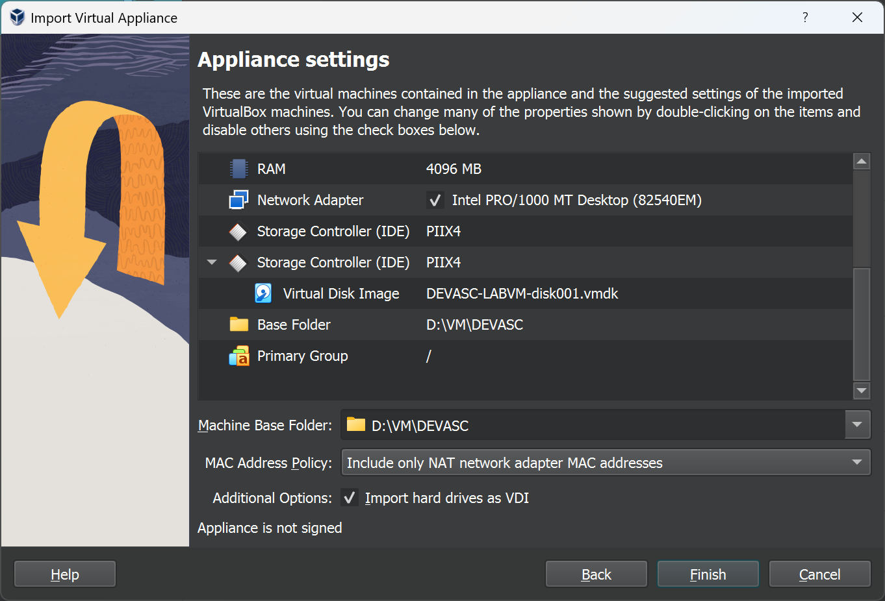

Empezando VM e iniciando imágen de Ubuntu
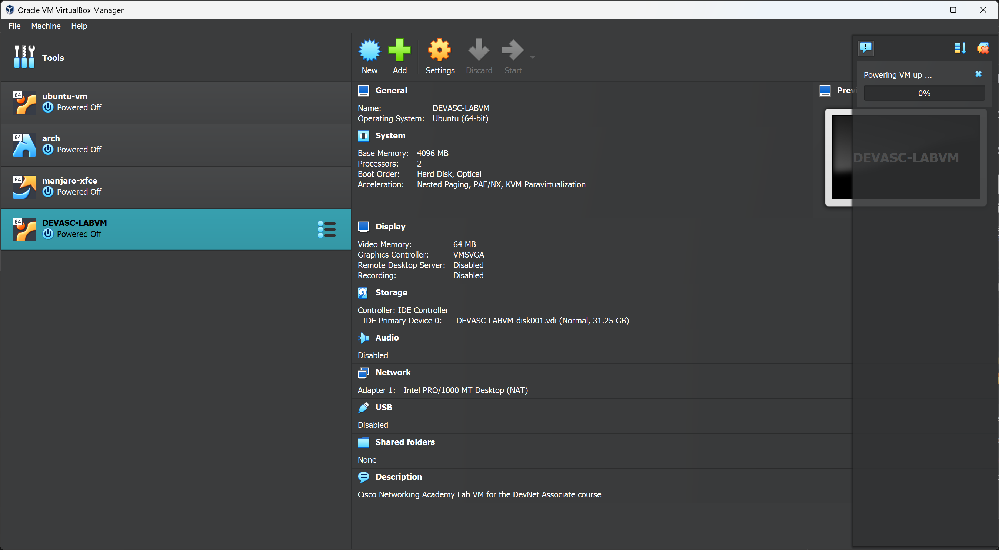

## 2. Explore la GUI de DEVASC VM.

Aceptando EULA
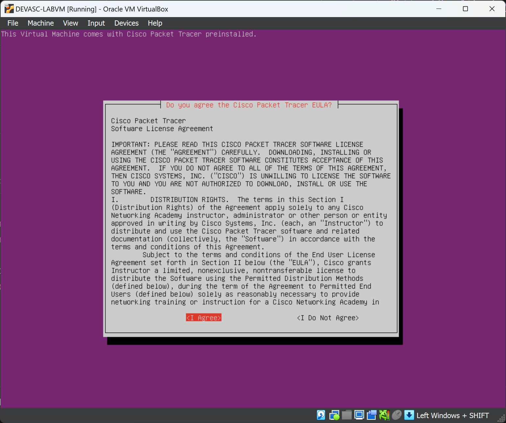

Desktop de Ubuntu
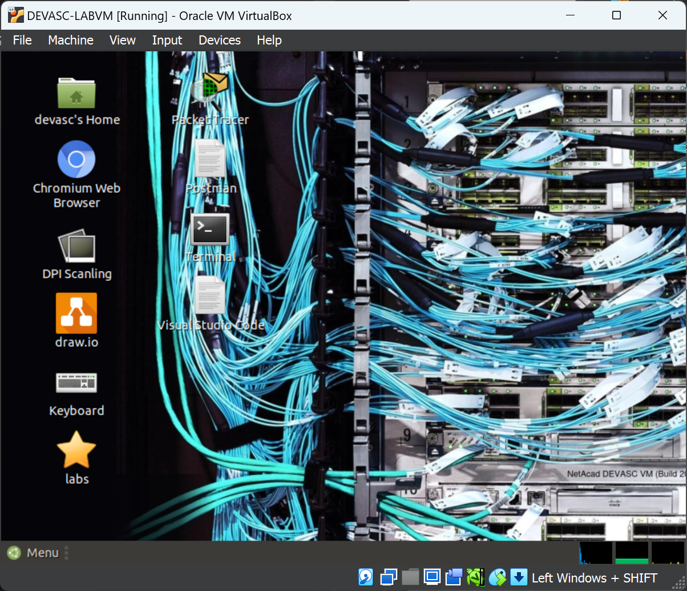

### Explorando aplicaciones

Terminal
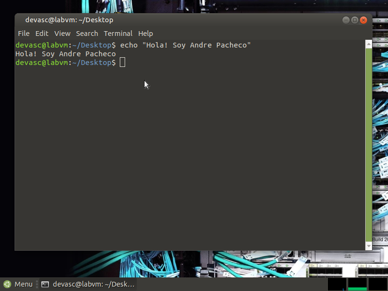

Chromium
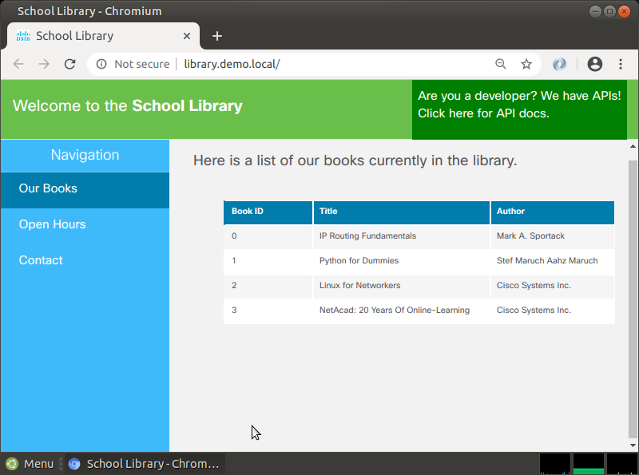

Postman (después de crear una cuenta)
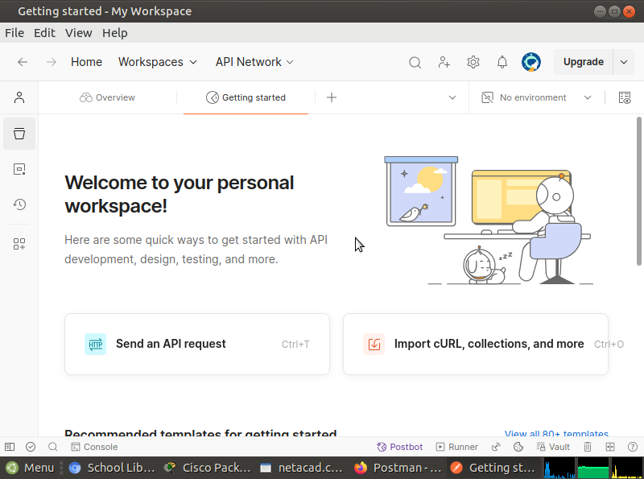

De momento no puedo iniciar sesión en Cisco

## 3. Crear cuentas de entorno de laboratorio.

Cuenta de Cisco DevNet


Cuenta de Github
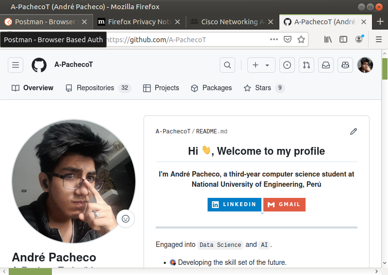

Cuenta de Webex Cisco


### Cerrando VM con GUI

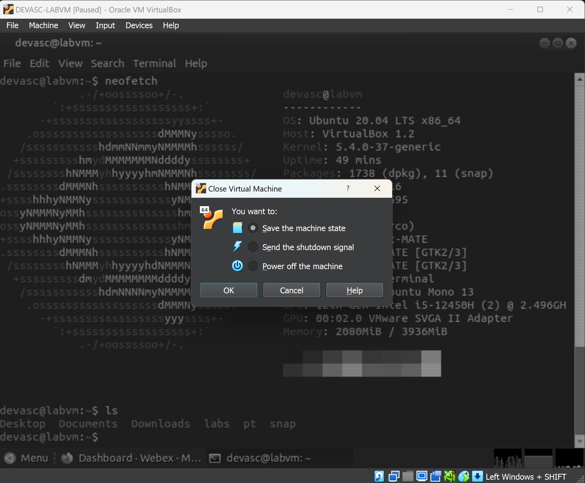


También se intentó cerrar la máquina virtual con el comando:

```
sudo shutdown -h now
```

Pero no se pudo realizar captura de pantalla por la rapidez con que se cerró la máquina.

De la misma manera con:

```
sudo reboot
```

## 4. Instalar la aplicación de Webex en su dispositivo.

Instalando la aplicación de Webex en Windows

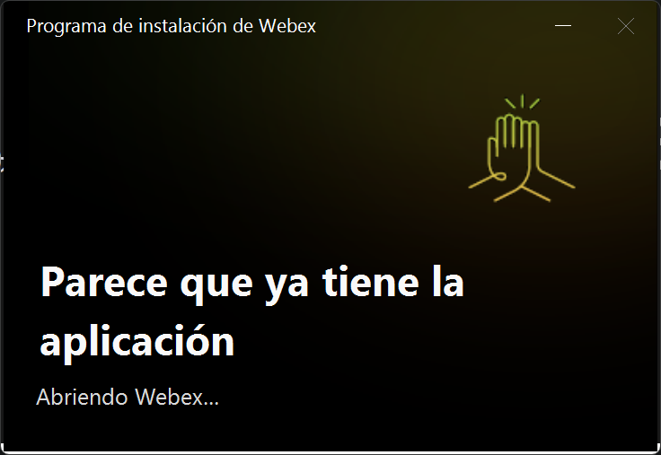
Whoops ya tengo la aplicación instalada

Después de iniciar sesión
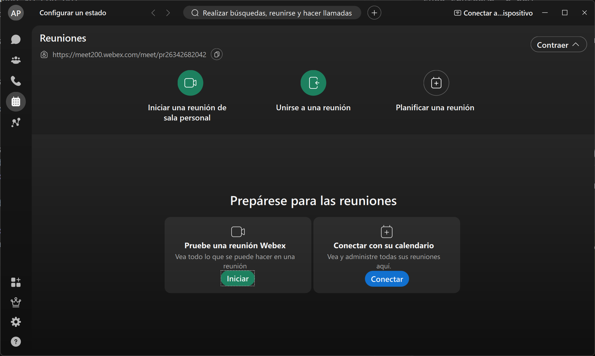

Creando un equipo y compartiendolo con un compañero
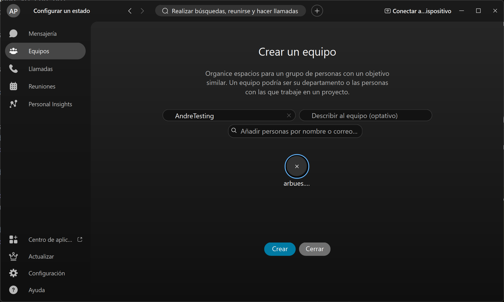
