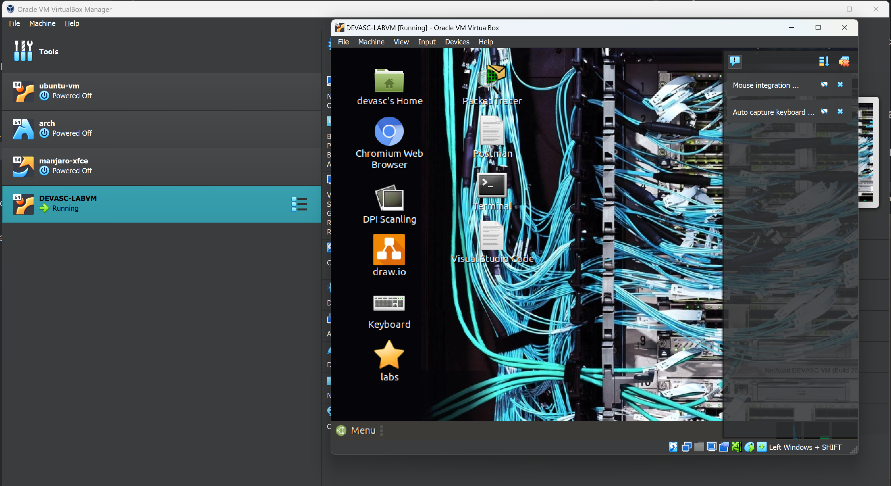
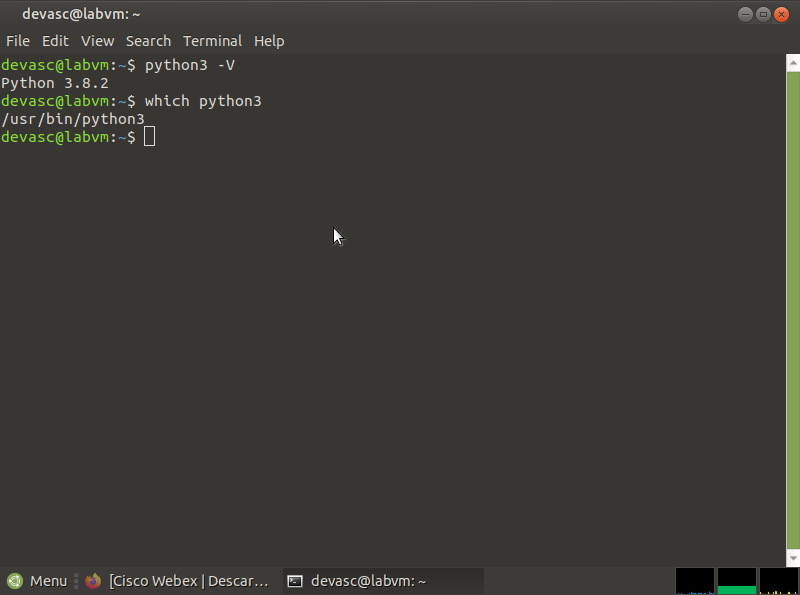
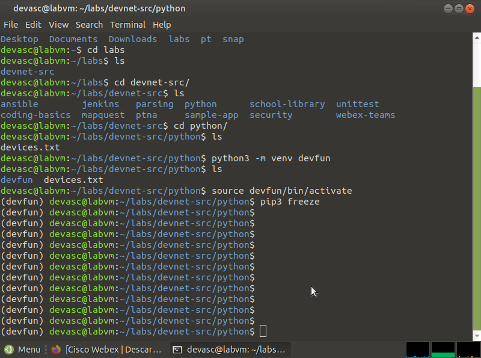
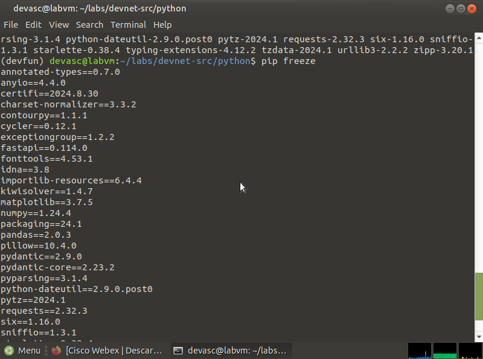
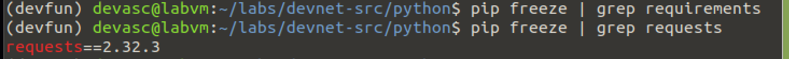
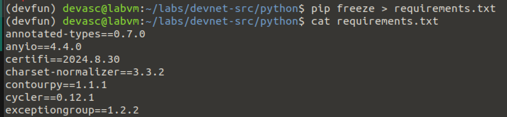
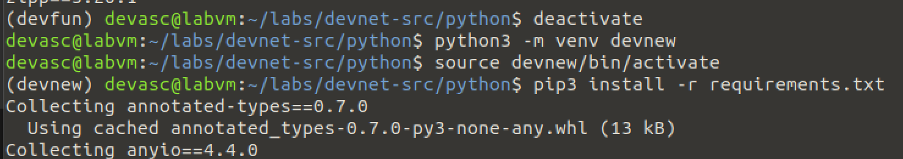
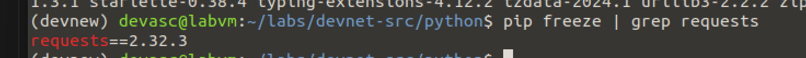

# Práctica de Laboratorio 2b

## **Explorar las herramientas de desarrollo de Python**

### Objetivos:

- Parte 1: Iniciar la Máquina Virtual (Virtual Machine) DEVASC.
- Parte 2: Revisar la instalación de Python.
- Parte 3: Entornos virtuales PIP y Python.
- Parte 4: Compartir su entorno virtual.

## 1. Iniciar la Máquina Virtual (Virtual Machine) DEVASC.

## 2. Revisar la instalación de Python.

- Abra una terminal dentro de la VM DEVASC.
- Verifique la versión de Python instalada utilizando `python3 -V`.
- Compruebe la ubicación del ejecutable de Python con el comando `which python3`.

## 3. Entornos virtuales PIP y Python.

- Navegue al directorio donde trabajará con Python en la VM.
- Cree un entorno virtual usando el módulo `venv` con `python3 -m venv devfun`.
- Active el entorno virtual e instale las dependencias necesarias utilizando `pip3`.
- Use `pip3 freeze` para listar las dependencias instaladas.

Pip3 freeze antes (vacío):

pip3 freeze después (con dependencias):

Ojo: se instaló requests, numpy, pandas, matplotlib y FastAPI

Se comprueba la instalación de requests:

- Guardando las dependencias en un archivo requirements.txt:
  

- Instalando nuevo entorno con requirements.txt:
  

- Verificando requests en el nuevo entorno:
  

- Por último se desactivó el entorno virtual con `deactivate`.

## Reflexiones

> Levantar un entorno virtual, como hicimos para Python en este laboratorio, es algo que todos deberíamos adoptar rutinariamente. Esto evita una cantidad de problemas comunes, como conflictos entre dependencias y problemas de compatibilidad, que pueden hacer que un proyecto de desarrollo se detenga.
>
> He descubierto que el manejo de entornos virtuales no es sólo una habilidad técnica esencial, sino una forma de asegurar que nuestros proyectos sean reproducibles y estables en cualquier máquina. Esto es crucial para trabajar en equipo y para mantener la sanidad del código a largo plazo.
>
> _André Pacheco_
