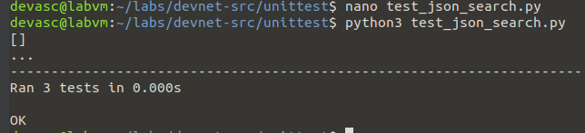

# Laboratorio 3a - Crear una prueba unitaria de Python

## Instrucciones

### Parte 1: Iniciar la máquina virtual (Virtual Machine) de DEVASC

Hecho!

### Parte 2: Explorar las opciones en el framework unittest


### Parte 3: Probar una función Python con unittest

#### Paso 1: Revisar el archivo test_data.py


#### Paso 2: Crear la función json_search() que se va a probar

```
nano recursive_json_search.py
```


Como es de esperar no funciona


#### Paso 3: Crear algunas pruebas unitarias

Se arreglo los errores de sintáxis de recursive_json_search.py

Prueba unitaria:


#### Paso 4: Ejecutar la prueba para ver los resultados iniciales


Como vemos hay errores.

#### Paso 5: Investigar y corregir el primer error

#### Paso 6: Ejecutar la prueba de nuevo


#### Paso 7: Investigar y corregir el segundo error


### Extra pasos

Me di cuenta que el error que me salía era porque puse una mayúscula `S` en lugar de `s` en `test_json_search.py`, en `self.asertisInstance`. Además que es `self.asertIsInstance`.


Luego de esos 2 cambios, la prueba unitaria funcionó.



## Reflexión

En este laboratorio se aprendió a crear pruebas unitarias en Python utilizando el framework unittest. Se exploraron los conceptos de clases de prueba, métodos de prueba, y manejo de aserciones. Además, se trabajó con estructuras de datos JSON y se aplicaron técnicas de recursividad para buscar información dentro de los datos.

Este conocimiento es esencial para garantizar la calidad del software, ya que permite verificar que el código funcione correctamente bajo diferentes escenarios y condiciones. Las pruebas unitarias son fundamentales para asegurar que los cambios en el código no introduzcan nuevos errores y para garantizar que el software cumpla con los requisitos esperados.
