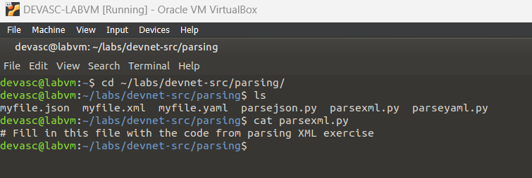
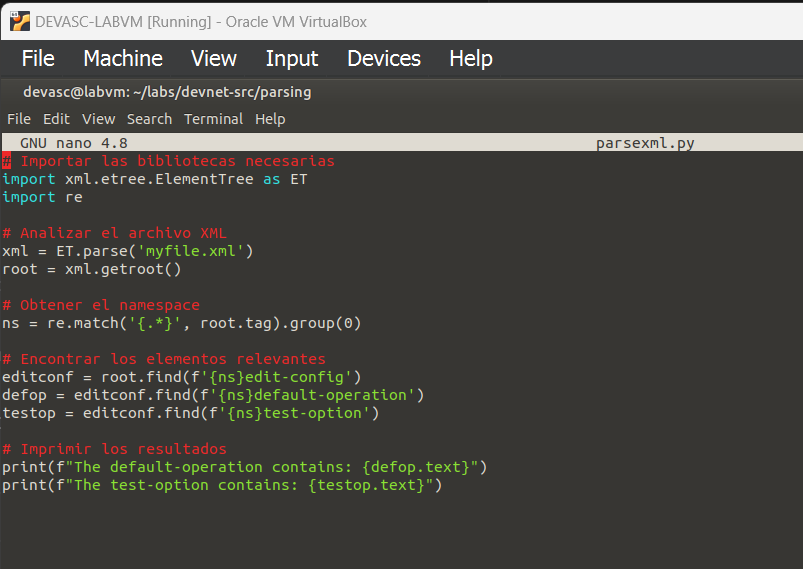
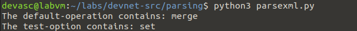
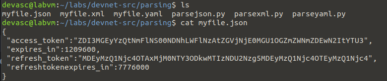
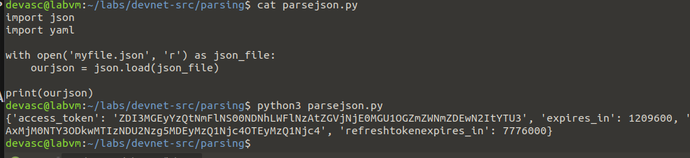
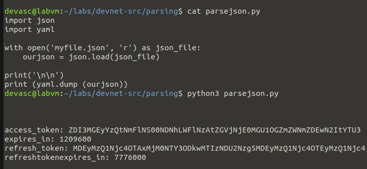
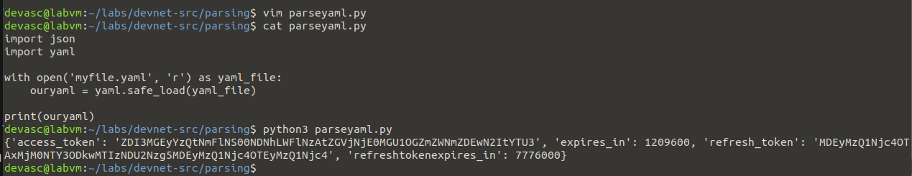
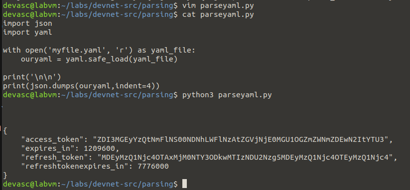

# Laboratorio 3b - Analizar diferentes tipos de datos con Python

## Instrucciones

### Parte 1: Iniciar la máquina virtual (Virtual Machine) de DEVASC

Hecho!

### Parte 2: Analizar XML en Python

#### Paso 1: Crear un script para analizar los datos XML'

#### Paso 2: Ejecutar el script

### Parte 3: Analizar JSON en Python

Analizar datos JSON utilizando la biblioteca json de Python y a convertirlos a YAML.

#### Paso 1: Crear un script para analizar los datos JSON

Vemos contenido del json:

Codificamos el script usando el método `json.load (archivo_json)` para analizar los datos JSON.

#### Paso 2: Ejecutar el script para imprimir los datos JSON y luego modificarlo para imprimir datos de interés

Después de ejecutar el script:

#### Paso 3: Mostrar los datos JSON analizados en un formato de datos YAML

### Parte 4: Analizar YAML en Python

En esta parte, aprenderá a analizar datos YAML y convertirlos a JSON.

#### Paso 1: Crear un script para analizar los datos de YAML

Usamos el método `yaml.safe_load (archivo_yaml)` para analizar los datos de YAML.

#### Paso 2: Ejecutar el script para imprimir los datos de YAML y luego modificarlo para imprimir datos de interés

#### Paso 3: Mostrar los datos YAML analizados en un formato de datos JSON

Observamos un formato más legible por la identación incluída.

## Reflexión

En este laboratorio se aprendió a analizar datos XML, JSON y YAML. El uso de bibliotecas de Python para analizar datos es una buena manera de aprender.
