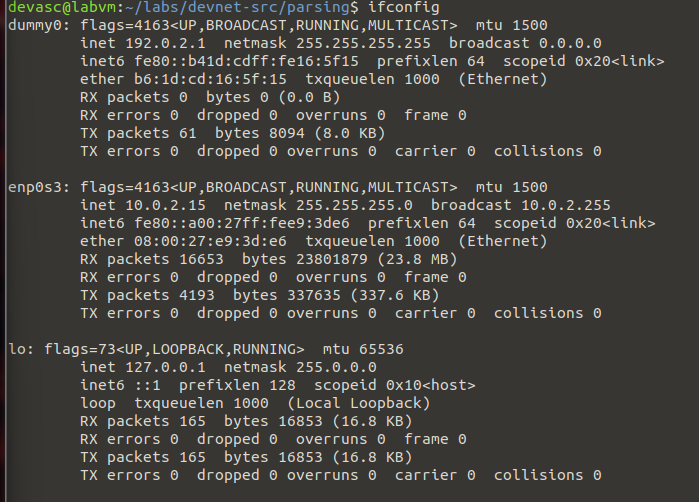
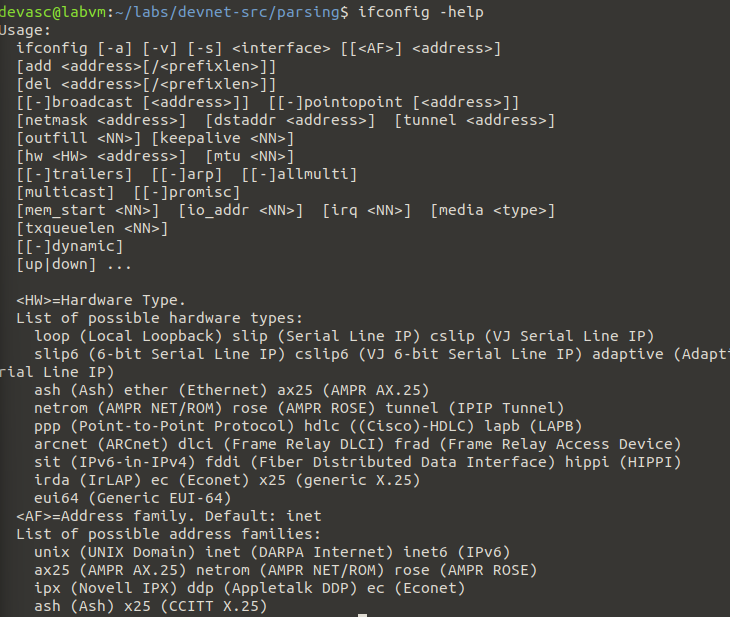
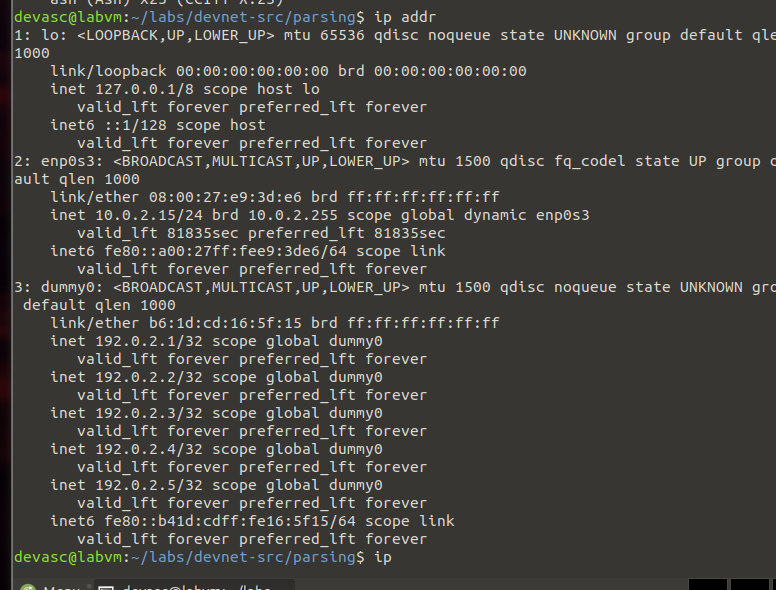
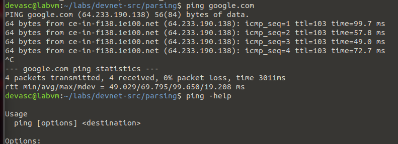
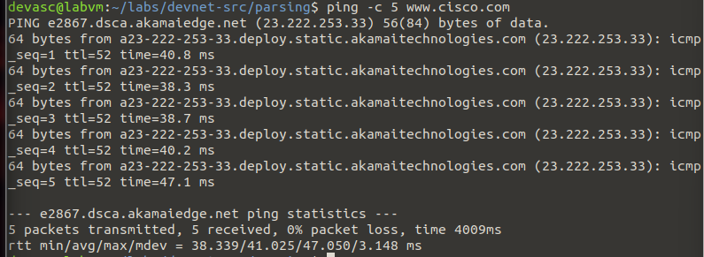
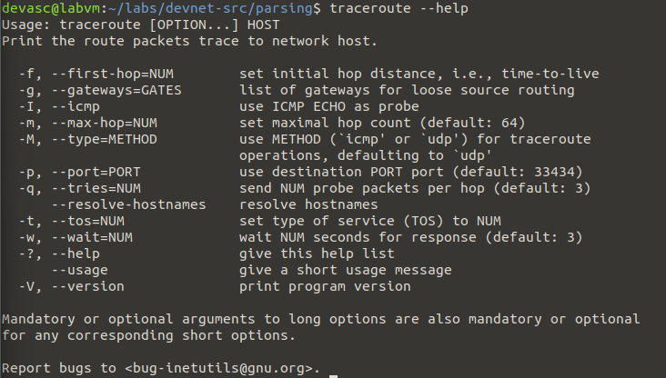
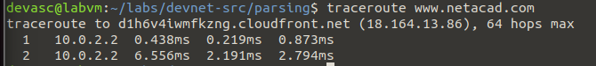
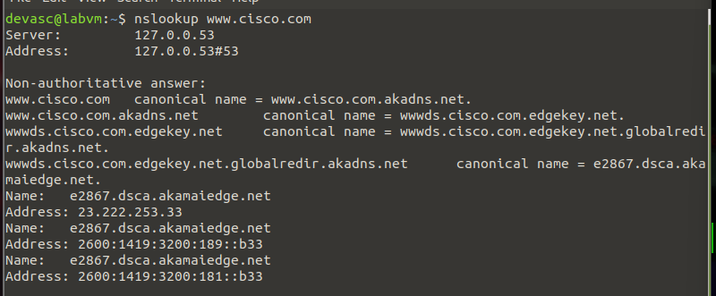
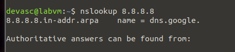
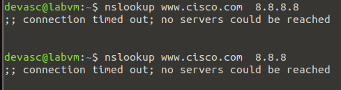

# Herramientas de resolución de problemas de red

**_Práctica de laboratorio 5_**

## Parte 1: Inicie la máquina virtual de DEVASC.

Listo!

## Parte 2: Explore la herramienta de solución de problemas ifconfig

Usando comando:

```bash
ifconfig
```



Usando flags

- help: Muestra manual
  

- add: Agregar una interfaz

- delete: Eliminar una interfaz

- down: Apagar una interfaz

- up: Encender una interfaz

- hw ether: Cambiar la dirección MAC

Usando el comando ip

- ip addr: Muestra las direcciones IP



# Parte 3: Explore la herramienta de resolución de problemas de ping

Primero procedí a ejecutar el comando ping a google.com; luego usé el flag -help para ver el manual de uso:


Luego ejecuté el comando ping a www.cisco.com con el flag -c 5 para que se ejecutara 5 veces:



## Parte 4: Explore la herramienta de solución de problemas de trazar la ruta(traceroute)

Primero vi la documentación de traceroute:



Luego ejecuté el comando traceroute a www.netacad.com con el comando:

```bash
traceroute www.netacad.com
```



La salida muestra que se dieron 2 saltos para llegar al destino.

## Parte 5: Explore la herramienta de solución de problemas de nslookup

Primero quise determinar el IP de www.cisco.com, para eso usé el comando:

```bash
nslookup www.cisco.com
```



Luego consulté la dirección IP 8.8.8.8 para ver que pasaba y me arrojó que era un servidor DNS de Google:



Paso 3: Consulte un dominio mediante un servidor DNS específico.

En este paso me salión 'connection timed out' y no pude realizar la consulta.


