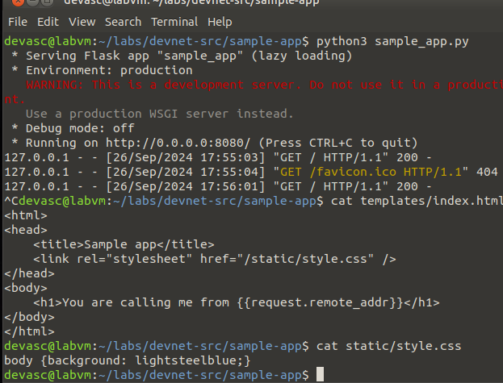
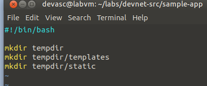

# Práctica de laboratorio 6a: Crear una aplicación web de muestra en un contenedor Docker

## Scripts de bash

Creando script bash, editándolo y ejecutándolo.


Ejecución:


Cambiando los permisos del archivo con la flag a+x para que sea ejecutable desde todos los usuarios:


Cambiando nombre del archivo para eliminar la extensión .sh. Ahora se puede ejecutar directamente desde la terminal con ./user-input:


## Crear App web de muestra

Editando archivo con vim y creando una app web de muestra en python con Flask:


Código:

```
from flask import Flask
from flask import request

muestra = Flask(__name__)

@muestra.route("/")
def main():
    return "Me estás llamando desde " + request.remote_addr + "\n"

if __name__ == "__main__":
    muestra.run(host="0.0.0.0", port=8080)
```

Ejecutando el archivo .py:


Interfaz web:


Asegurándonos de que la app funcione correctamente con curl:


### Viendo index.html y style.css



### Renderizando index.html y style.css con flask

Código:

```
from flask import Flask, request, render_template

sample = Flask(__name__)

@sample.route('/')
def home():
    return render_template('index.html')

if __name__ == '__main__':
    sample.run(host='0.0.0.0', port=8080)
```

Me cansé de usar nano así que empecé a usar vim.


Ejecutando el archivo:


## Crear un script de Bash para compilar y ejecutar un contenedor Docker

Creando bash para crear las carpetas temporales y copiar los archivos necesarios



### Creando Dockerfile

Creándolo con echo desde la terminal:


Así se ve el Dockerfile:


Construyendo el contenedor...


Al terminar:


Ahora, ejecutando el contenedor con:

```
docker run -t -d -p 8080:8080 --name samplerunning sampleapp
```


Como ven nos devuelve la id.

Viendo el estado del contenedor con `docker ps -a`:


Exited (2) 35 seconds ago indica que el contenedor ha terminado su ejecución. El código de salida (2) generalmente indica un error.

### Ejecutando script de bash


Después de ejecutar el script, no cargaba la app. Vi el log del contenedor con `docker logs samplerunning`.


Me di cuenta que la imagen Python no se había especificado en el Dockerfile, así que agregué la imagen Python:3.9-slim como base de la imagen. Además cambié la última línea del Dockerfile para que sea `CMD ["python", "/home/myapp/sample-app.py"]`.


Luego de instanciar el contenedor con el nuevo Dockerfile, la app se cargó correctamente, pero todavía no se podía acceder a la interfaz web.
Entré al contenedor con `docker exec -it samplerunning /bin/bash` y con curl me di cuenta que no retornaba nada a pesar de que la app se estaba ejecutando.


al ver el `docker logs samplerunning` pude ver que había un problema al iniciar los hilos.


al ver `docker logs samplerunning` pude ver que el problema no era de recursos de CPU, pues su uso es mínimo.


Investigando di con que Flask tenía problemas con el threading. Por ello usé gunicorn para ejecutar la app. Para ello edité el archivo Dockerfile para que instale gunicorn y agregué una línea para ejecutar la app con gunicorn.


Luego eliminé todas las instancias de los contenedores con `docker ps -a` y `docker rm` y volví a ejecutar el script.

Ahora sí al fin pude acceder a la app.


Ahora sí seguimos con el laboratorio 6b.

Usando ip address:


Efectivamente, la IP es 172.17.0.0/16 para la red de los contenedores de docker.

Luego de hacer esto me di cuenta que hice todo lo que pedía el resto del laboratorio 6b; lo cual fue necesario para debugear el problema de la app. Aprendí mucho sobre como se comportan las redes de docker y como se puede acceder a ellas.
