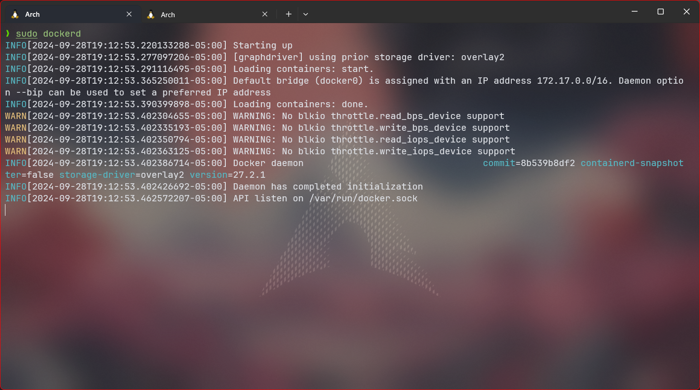

# Práctica de laboratorio 7: Build a CI/CD Pipeline Using Jenkins

### Part 1: Launch the DEVASC VM


### Part 2: Commit the Sample App to Git

Creando repositorio en GitHub:


Configurando credenciales en la máquina virtual:


Inicializando repositorio local:


Enlazando con el repositorio remoto y agregando los archivos con add, commiteando y puseando a master:


El uso de contraseñas para la autenticación es más fácil de implementar, pero Github deprecó el uso de contraseñas para la autenticación por lo que se uso claves ssh.
Por ello tengo que crear una clave ssh:


con

```
cat ~/.ssh/id_rsa.pub
```

vemos la clave. Esta clave se añade a las llaves de mi cuenta de github:


Finalmente puedo pushear a mi repositorio remoto:


### Part 3: Modify the Sample App and Push Changes to Git

Ahora cambiemos achivos...

Se cambia el puerto en el .py y .hs:


Tenía el contenedor creado así que tuve que eliminar y volver a crearlo:


Y vuelvo a ejecutar el .sh:


Listo, ya tenemos el contenedor funcionando con el nuevo puerto.

Por ultimo subimos los cambios a mi repositorio remoto:


Efectivamente se pushearon los cambios.


### Part 4: Download and Run the Jenkins Docker Image

#### Descargamos la imagen lts de jenkins con el comando:

```
docker pull jenkins/jenkins:lts
```


#### Empezamos el contenedor con el comando:

```
docker run --rm -u root -p 8080:8080 -v jenkins-data:/var/jenkins_home -v $(which docker):/usr/bin/docker -v /var/run/docker.sock:/var/run/docker.sock -v "$HOME":/home --name jenkins_server jenkins/jenkins:lts
```

Tuve un error al iniciar el contenedor, por falta de memoria RAM; pero por más que le puse +10GB de RAM no me dejaba iniciar el contenedor.


Luego de insistentes errores al seguir con el laboratorio, decidí proseguir usando el Windows Subsytem for Linux (WSL). En particular estoy usando Arch Linux WSL.

Prendo docker daemon



Descargo la imagen de jenkins 2.414.3-slim-jdk17 que es compatible con la clave ssh con la que enlazé mi repositorio remoto:


Ejecuto el contenedor con el comando:

```
docker run --rm -u root -p 8080:8080 -v jenkins-data:/var/jenkins_home -v $(which docker):/usr/bin/docker -v /var/run/docker.sock:/var/run/docker.sock -v "$HOME":/home --name jenkins_server jenkins/jenkins:2.414.3-slim-jdk17
```


Ahora sí me salió el mensaje con la contraseña:


1c50ae0907ff46828edce82287cd93e7

También me cersioro que esa es la contraseña al entrar al contenedor:


#### Configuramos jenkins:

Entramos con la contraseña que obtuvimos en localhost:8080


Instalamos los plugins sugeridos.

Skipeamos crear un usuario.

Dejé la config como estaba.


Listo! Ya estamos en el panel de jenkins.


#### Usamos jenkins para construir nuestra app:

Creamos un job BuildAppJob. Se eligió un Freestyle project.


Se establecieron el link del repositorio remoto y las credenciales de github en la configuración del job.


Se agregó un Build Step de tipo Execute shell con el comando de construcción del contenedor:


Se guardó la configuración.

#### Usamos jenkins para testear la construcción de nuestra app:

Le di a Build Now. Salida de consola:


Además observamos que se creó el contenedor `sampleapp` con el build. Se ve en la consola y también en mi WSL:


Y se puede acceder a la app:


#### Usamos jenkins para testear nuestra app

Se para y remueve el contenedor:


Creamos nuevo job para testing TestAppJob. Como Freestyle project.


Configuramos el job:


Corremos el BuildAppJob:


Como vemos se ejecutaron ambos jobs con éxito:


Log del testing:


Funcionando la app!:


#### Creamos pipeline en jenkins:

Cremos el item SamplePipeline de tipo Pipeline.


Configuramos la pipeline:

Agregamos Script:


Ejecutamos el pipeline:


Resultados:

Stage View:


Logs:


Además se comprobó que la app funcionaba.
