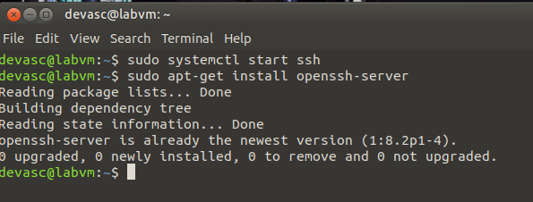
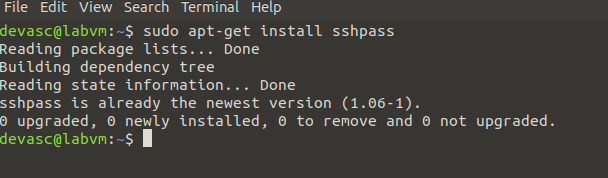
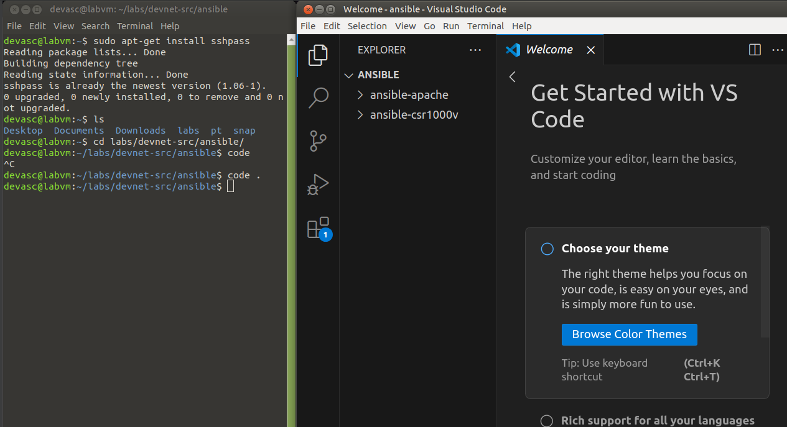
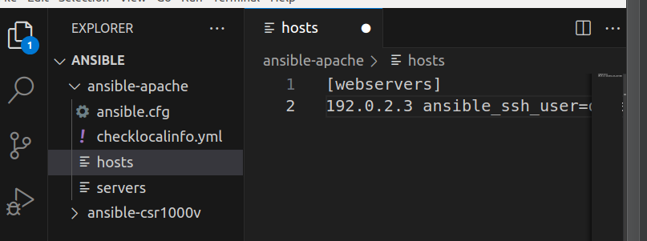
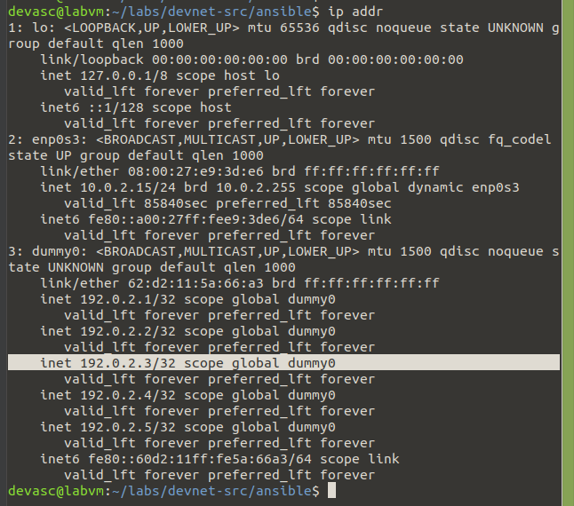
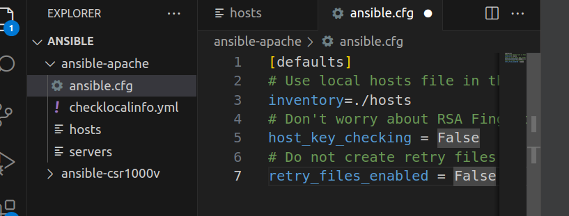
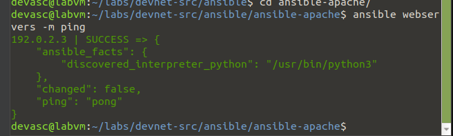
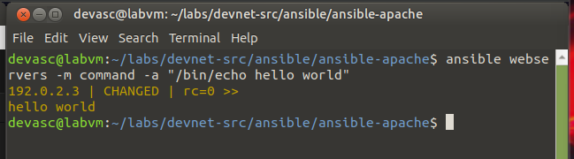
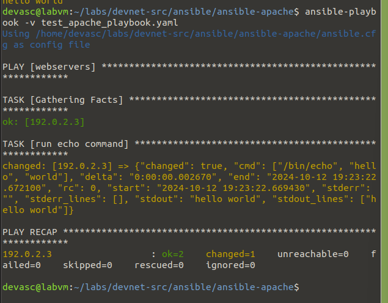
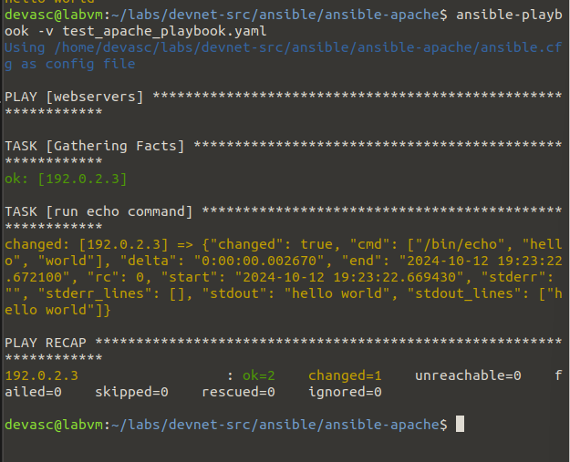

# Use Ansible to Automate Installing a Web Server
*André Joaquín Pacheco Taboada*

## Configurando Ansible

Abro terminal, inicio el ssh; me aseguro que está isntalado el openssh:



Igual está el sshpass



## Entro al directorio de ansible



Estaremos trabajando en el folder ansible-apache

Le agregamos al host:
```
[webservers]
192.0.2.3 ansible_ssh_user=devasc ansible_ssh_pass=Cisco123!
```



Las credenciales son las siguientes:
- Usuario: devasc
- Contraseña: Cisco123!

La dirección que usaremos para la máquina virtual será la que está bajo la interfaz dummy0



Editamos el archivo ansible.cfg con lo siguiente:
```
[defaults]
# Use local hosts file in this folder
inventory=./hosts 
# Don't worry about RSA Fingerprints
host_key_checking = False 
# Do not create retry files
retry_files_enabled = False
```



Verificamos las comunicaciones con el servidor web local pingeando:






## Creando el Playbook

Creamos el archivo test_apache_playbook.yaml con el siguiente contenido:

```
---
- hosts: webservers
  tasks:
    - name: run echo command
      command: /bin/echo hello world
```

Corremos el playbook con el siguiente comando:
```
ansible-playbook -v test_apache_playbook.yaml
```
La flag -v es para que se vea el output del playbook.



Creando el playbook install_apache.yaml para instalar el apache2

```
---
- hosts: webservers
  become: yes
  tasks:
    - name: INSTALL APACHE2
      apt: name=apache2 update_cache=yes state=latest
 
    - name: ENABLED MOD_REWRITE
      apache2_module: name=rewrite state=present
      notify:
        - RESTART APACHE2
 
  handlers:
    - name: RESTART APACHE2
      service: name=apache2 state=restarted
```

Corremos el playbook con el siguiente comando:
```
ansible-playbook -v install_apache.yaml
```



Como vemos, el playbook escribió el mensaje "hello world" en el archivo index.html de la máquina virtual. En la ip 192.0.2.3.
```
192.0.2.3                  : ok=2  
```

## Creando 