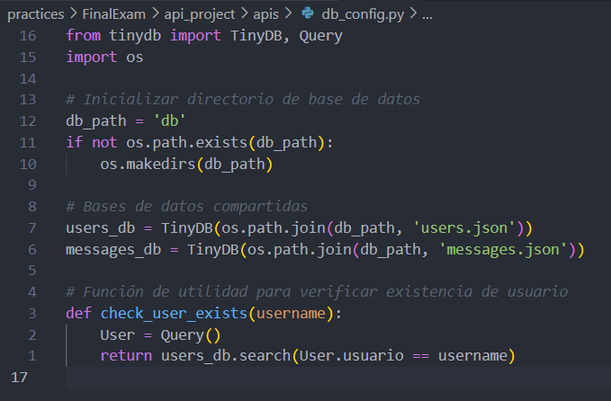
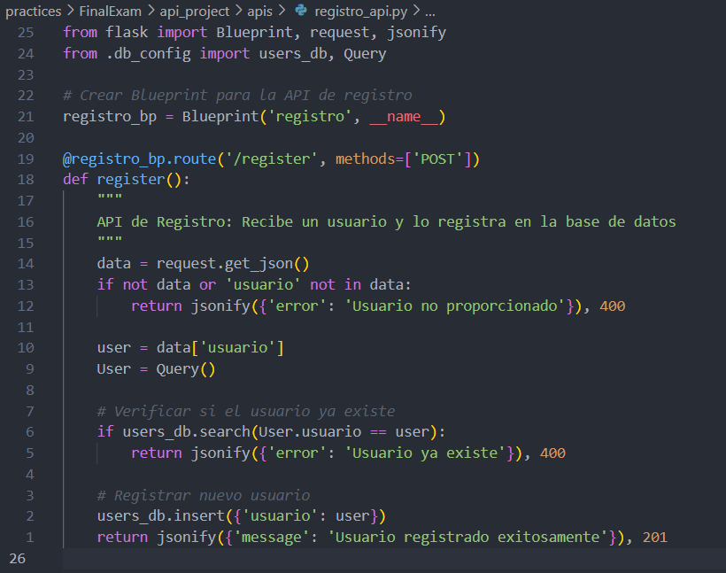
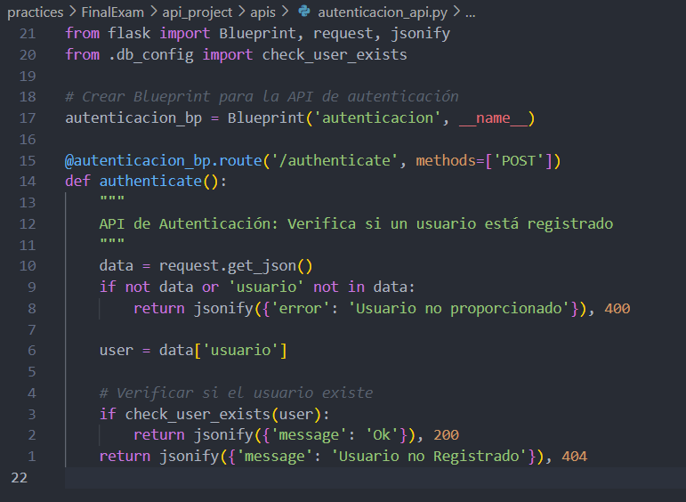
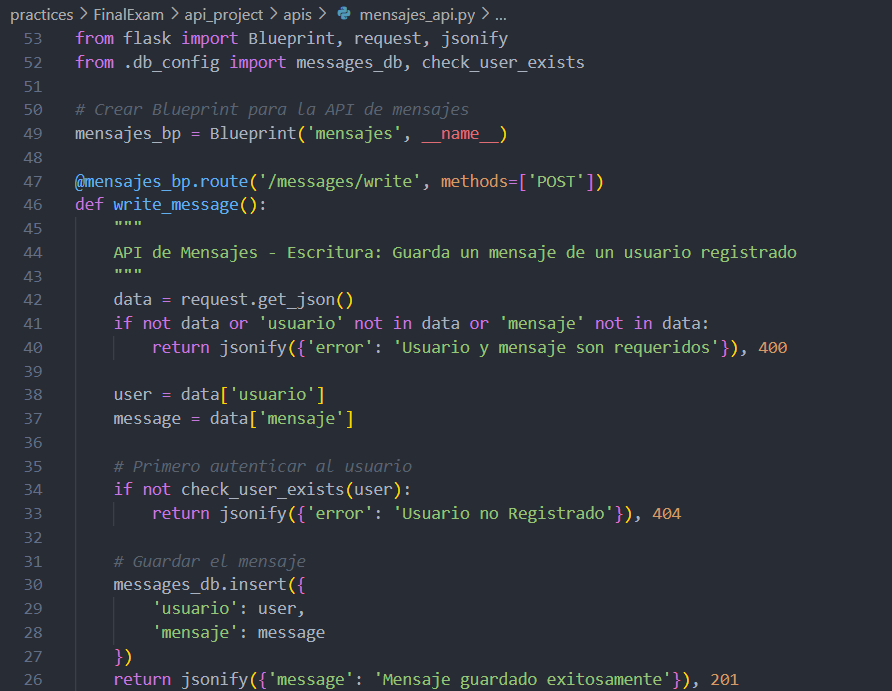
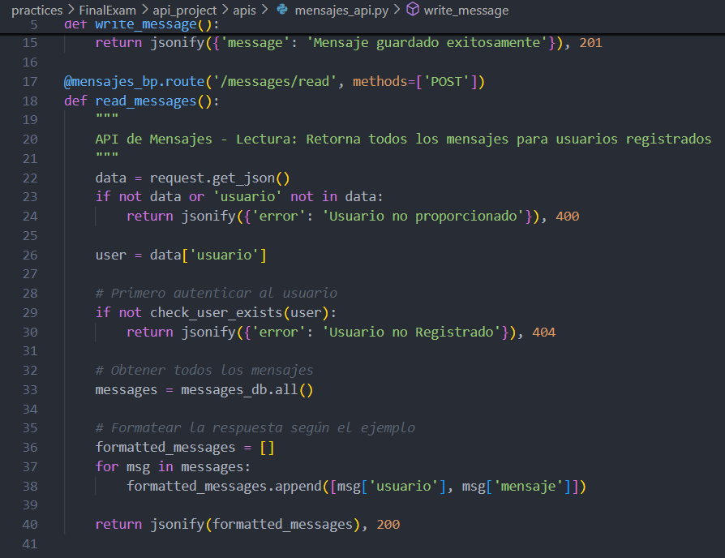
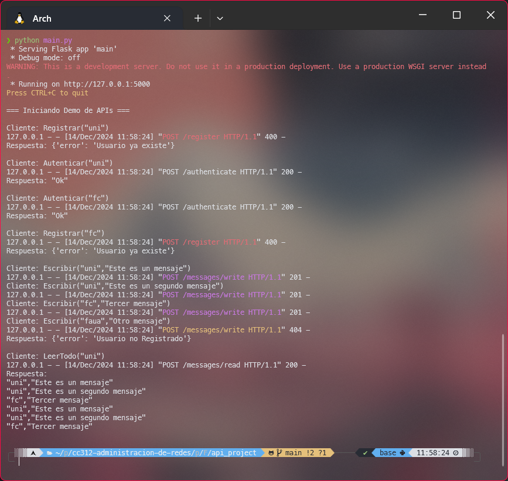

# <font color="#7F000E" size=5>Examen Final</font>

<br>
<div style="text-align: right">
<font color="#7F000E" size=3>Curso: Administración de Redes</font><br>
<font color="#7F000E" size=3>Semestre: 2024-II</font><br>
<font color="#7F000E" size=3>Ciencias de la Computación - UNI</font><br>
</div>

<br>

<div style="display: flex; justify-content: space-between;">
    <div>
        <strong>Apellidos y Nombres:</strong> <span style="border-bottom: 1.5px dotted black;">Pacheco Taboada André Joaquín</span>
    </div>
    <div>
        <strong>Código:</strong> <span style="border-bottom: 1.5px dotted black;">20222189G</span>
    </div>
</div>

## Desarrollo del Examen: Sistema de APIs con Flask

Para este examen, desarrollé un sistema de tres APIs interconectadas usando Flask y TinyDB. Separé cada API en su propio archivo para mantener el código organizado y fácil de mantener.

### 1. Configuración de Base de Datos (`db_config.py`)
Primero, implementé la configuración central de la base de datos usando TinyDB. Aquí definí las bases de datos compartidas para usuarios y mensajes, junto con funciones de utilidad.


### 2. API de Registro (`registro_api.py`)
Desarrollé la primera API para manejar el registro de usuarios. Esta API recibe solicitudes POST con un nombre de usuario y lo almacena en la base de datos si no existe.



### 3. API de Autenticación (`autenticacion_api.py`)
La segunda API verifica si un usuario está registrado. Retorna "Ok" si el usuario existe o "Usuario no Registrado" si no existe.



### 4. API de Mensajes (`mensajes_api.py`)
La tercera API maneja la escritura y lectura de mensajes. Implementé dos endpoints:
- Escritura: Guarda mensajes de usuarios registrados
- Lectura: Retorna todos los mensajes almacenados

Endpoint de escritura:


Endpoint de lectura:


### 5. Programa Principal (`main.py`)
Finalmente, creé un programa principal que integra las tres APIs y ejecuta una demostración automática de todas las funcionalidades. El ejemplo de ejecución que usé es el mismo que se muestra en el enunciado del examen.
```
Cliente: Registrar(“uni”)
Cliente: Autenticar(“uni”)
Respuesta: “Ok”
Cliente: Autenticar(“fc”)
Respuesta: “Usuario no Registrado”
Cliente: Registrar(“fc”)
Cliente: Escribir(“uni”,”Este es un mensaje”)
Cliente: Escribir(“uni”,”Este es un segundo mensaje”)
Cliente: Escribir(“fc”,”Tercer mensaje”)
Cliente: Escribir(“faua”,”Otro mensaje”)
Cliente: LeerTodo(“uni”)
Respuesta: {
“uni”,”Este es un mensaje”,
“uni”,”Este es un segundo mensaje”,
“fc”,”Tercer mensaje”
}
```

Agregué un poco de logging para que se pueda visualizar las peticiones (métodos POST) que se hacen a los endpoints de las APIs.

Se corre el programa con el siguiente comando:
```
python main.py
```


### Resultados de la Ejecución
Al ejecutar el programa, se realizan automáticamente todas las operaciones solicitadas en el ejemplo:



#### En texto
```
❯ python main.py
 * Serving Flask app 'main'
 * Debug mode: off
WARNING: This is a development server. Do not use it in a production deployment. Use a production WSGI server instead.
 * Running on http://127.0.0.1:5000
Press CTRL+C to quit

=== Iniciando Demo de APIs ===

Cliente: Registrar("uni")
127.0.0.1 - - [14/Dec/2024 11:58:24] "POST /register HTTP/1.1" 400 -
Respuesta: {'error': 'Usuario ya existe'}

Cliente: Autenticar("uni")
127.0.0.1 - - [14/Dec/2024 11:58:24] "POST /authenticate HTTP/1.1" 200 -
Respuesta: "Ok"

Cliente: Autenticar("fc")
127.0.0.1 - - [14/Dec/2024 11:58:24] "POST /authenticate HTTP/1.1" 200 -
Respuesta: "Ok"

Cliente: Registrar("fc")
127.0.0.1 - - [14/Dec/2024 11:58:24] "POST /register HTTP/1.1" 400 -
Respuesta: {'error': 'Usuario ya existe'}

Cliente: Escribir("uni","Este es un mensaje")
127.0.0.1 - - [14/Dec/2024 11:58:24] "POST /messages/write HTTP/1.1" 201 -
Cliente: Escribir("uni","Este es un segundo mensaje")
127.0.0.1 - - [14/Dec/2024 11:58:24] "POST /messages/write HTTP/1.1" 201 -
Cliente: Escribir("fc","Tercer mensaje")
127.0.0.1 - - [14/Dec/2024 11:58:24] "POST /messages/write HTTP/1.1" 201 -
Cliente: Escribir("faua","Otro mensaje")
127.0.0.1 - - [14/Dec/2024 11:58:24] "POST /messages/write HTTP/1.1" 404 -
Respuesta: {'error': 'Usuario no Registrado'}

Cliente: LeerTodo("uni")
127.0.0.1 - - [14/Dec/2024 11:58:24] "POST /messages/read HTTP/1.1" 200 -
Respuesta:
"uni","Este es un mensaje"
"uni","Este es un segundo mensaje"
"fc","Tercer mensaje"
"uni","Este es un mensaje"
"uni","Este es un segundo mensaje"
"fc","Tercer mensaje"
```