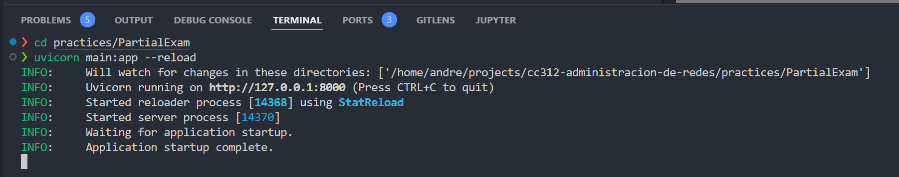
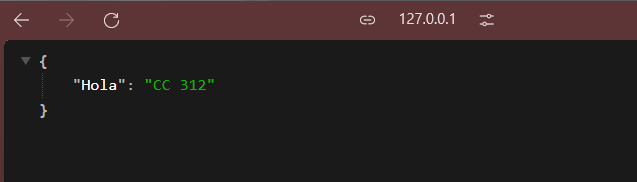
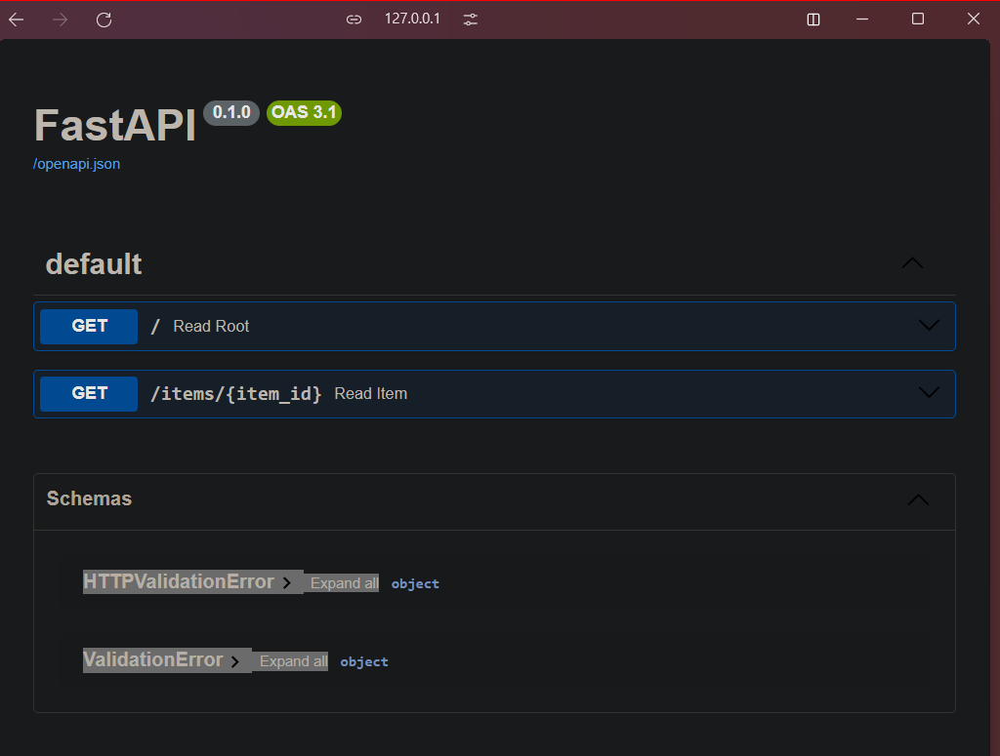
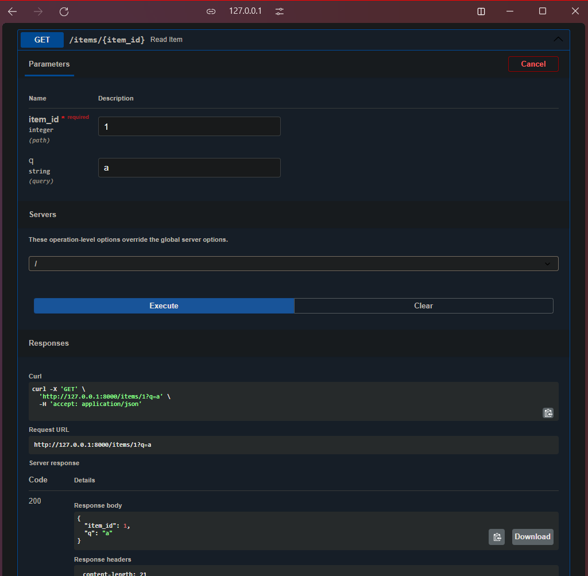

# <font color="#7F000E" size=5>Examen Parcial</font>

<br>
<div style="text-align: right">
<font color="#7F000E" size=3>Curso: Administración de Redes</font><br>
<font color="#7F000E" size=3>Semestre: 2024-II</font><br>
<font color="#7F000E" size=3>Ciencias de la Computación - UNI</font><br>
</div>

<br>

<div style="display: flex; justify-content: space-between;">
    <div>
        <strong>Apellidos y Nombres:</strong> <span style="border-bottom: 1.5px dotted black;">Pacheco Taboada André Joaquín</span>
    </div>
    <div>
        <strong>Código:</strong> <span style="border-bottom: 1.5px dotted black;">20222189G</span>
    </div>
</div>


## <font color="#7F000E" size=4>Pregunta 1</font>

### <font color="#7F000E" size=3>1.1 ¿Cómo añadiría con el comando ip, el IP 192.168.1.50/20 a la interface eth0?</font>
```
ip addr add 192.168.1.50/20 dev eth0
```

### <font color="#7F000E" size=3>1.2 ¿Cómo deshabilitaría con el comando ip, la interface de red enp3s0?</font>
```
ip link set enp3s0 down
```

### <font color="#7F000E" size=3>1.3 El comando neighbour se utiliza para ver la dirección MAC de los dispositivos conectados a su sistema. ¿Cómo añadiría con el comando ip, la entrada ARP con el IP 192.168.1.50/24 a la interface enp3s0?</font>
```
ip neigh add 192.168.1.50 lladdr aa:bb:cc:dd:ee:ff dev enp3s0
```
Nota: Reemplazar `aa:bb:cc:dd:ee:ff` con la dirección MAC real.

### <font color="#7F000E" size=3>1.4 Si tenemos la ruta 192.168.4.0/20 que apunta a la interfaz enp3s0 ¿cómo la eliminamos?</font>
```
ip route del 192.168.4.0/20 dev enp3s0
```

### <font color="#7F000E" size=3>1.5 Explique qué resultado obtendrá con:
$ sudo nmcli connection add type ethernet ifname enp0s5</font>

Este comando creará una nueva conexión Ethernet en NetworkManager:
- Asociada a la interface enp0s5
- Con un nombre automático (e.g., "Ethernet connection 1")
- Configurada para DHCP por defecto
- Guardada en la configuración de NetworkManager, pero no activada automáticamente

Se mostrará un mensaje de confirmación con detalles como el nombre de la conexión y su UUID.


## <font color="#7F000E" size=4>Pregunta 2</font>
En el archivo `ejercicio-1_examen-parcial_2024-2.ipynb`


## <font color="#7F000E" size=4>Pregunta 3</font>
### <font color="#7F000E" size=3>3.1 Instalando FastAPI</font>

El comando para instalar FastAPI y Uvicorn es:

```bash
pip install fastapi uvicorn
```

En mi caso, ya tengo las bibliotecas instaladas en un entorno de Conda.

### <font color="#7F000E" size=3>3.2 Script</font>

El código se encuentra en el archivo `main.py`. De todas maneras adjunto el código a continuación:

```python
from typing import Union
from fastapi import FastAPI

app = FastAPI()


@app.get("/")
def read_root():
    return {"Hola": "CC 312"}

@app.get("/items/{item_id}")
def read_item(item_id: int, q: Union[str, None] = None):
    return {"item_id": item_id, "q": q}
```

### <font color="#7F000E" size=3>3.3 Ejecutando la aplicación</font>



### <font color="#7F000E" size=3>3.4 Comprobando en el navegador</font>

Por defecto, el servidor se ejecuta en el puerto 8000 y ejecuta el endpoint raíz (`read_root`).



### <font color="#7F000E" size=3>3.5 Revisando la documentación</font>



### <font color="#7F000E" size=3>3.6 Realizando una petición a la API</font>


