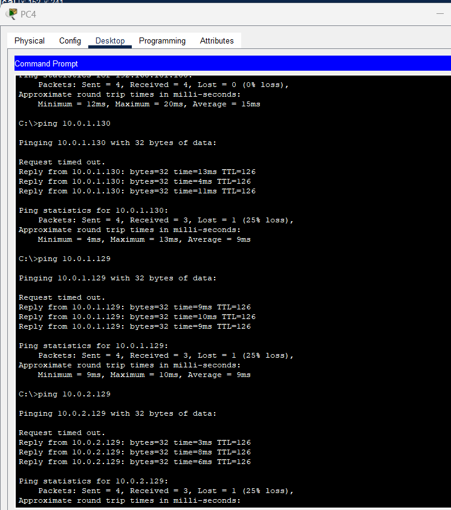
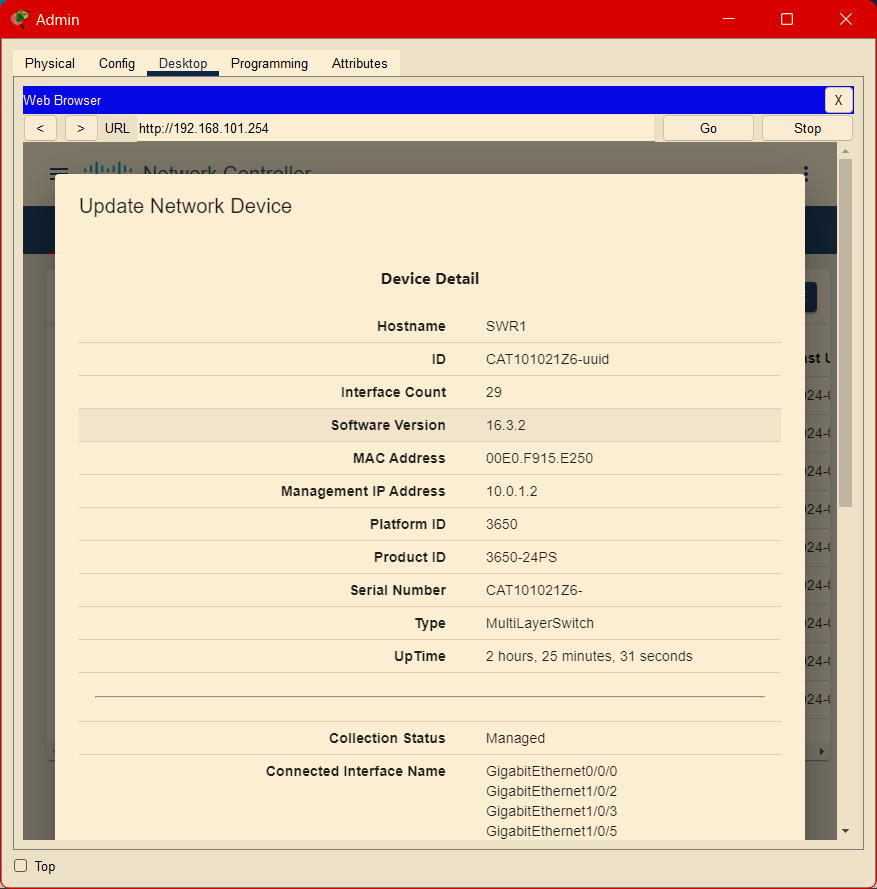
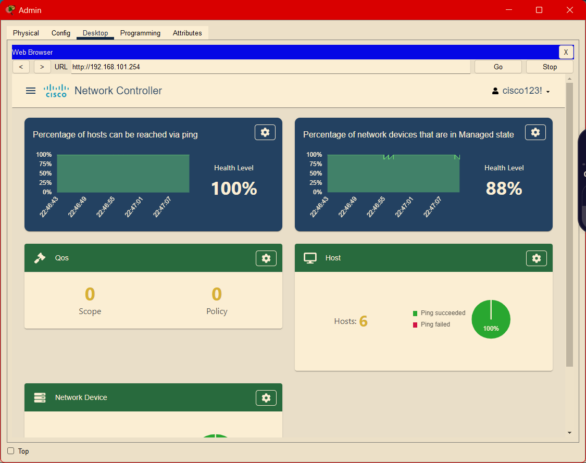
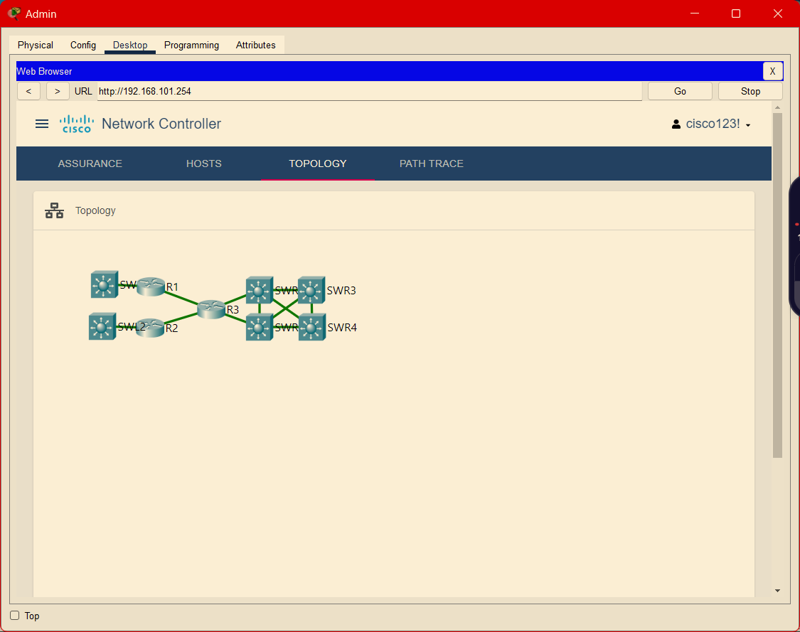
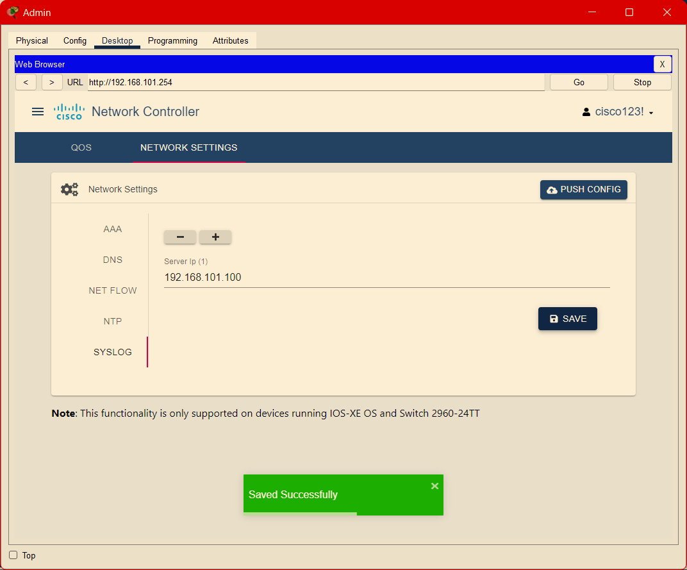

# Practice 1 - Network Administration (CC 312)

## Part 1: Packet Tracer - Compare CLI and SDN Controller NetworkManagement

Ingresamos al Packet Tracer. Tuve que buscar el .pka en internet para cargarlo y desarrollar el laboratorio.


### Usamos la CLI para recolección de datos de la red:

#### Nos aseguramos que los dispositivos pueden pingearse:

Ipv4 address de PC4 : 192.168.102.3


Ipv4 address de Example Server: 192.168.101.100

Haciendo el ping desde server a PC4:


Ahora hagamos pings desde los otros dispositivos a PC4:




Observamos que PC4 pudo pingear a todos los dispositivos.

---

Iniciamos sesión en la PC Admin y accedemos al SWR3 Switch:


Lo que arrojó:

```
Cisco IOS Software [Denali], Catalyst L3 Switch Software (CAT3K_CAA-UNIVERSALK9-M), Version 16.3.2, RELEASE SOFTWARE (fc4)
BOOTLDR: CAT3K_CAA Boot Loader (CAT3K_CAA-HBOOT-M) Version 4.26, RELEASE SOFTWARE (P)
```

Hacemos lo mismo con los demás switches:

SWR3:


SWR1:


SWR2:


SWR4:


R1:


R2:


R3:


SWL1:


SWL2:


---

Luego salimos de las sesiones ssh con `exit` en bucle hasta llegar a la PC Admin.

Siguiendo la guía entré a la guía de configuración de controles de red


Luego seguí con los pasos de la guía:

1. Agregar un nuevo control de red:


Lo ubiqué donde decía y vi que tiene el nombre que decía en la guía:


2. Conecto el control de red al switch SWL1


3. Pongo el default gateway en 192.168.101.1


4. Configuro interfaz GigabitEthernet0:
   

5. En REAL WORLD -> Controller; el server status estaba en Stopped así que proseguí como se ve en la guía:


---

Verificando conectividad con la PC Admin:


Funcionando!

Iniciando sesión a 192.168.101.254 (GigabitEthernet0):

1. Creando un nuevo usuario:


2. Creamos credenciales:


3. Usamos CDP para obtener información de los dispositivos:


Esperamos a que termine el proceso de discovery:


Devices:


De esta manera es más fácil ver la configuración de cada dispositivo.



Vemos las dashboards del Network Controller:



Se ve como una herramienta útil para la administración y monitoreo de la red. Vemos el número de hosts y devices.


También podemos ver el topology de la red:



Se puede ver el detalle de cada switch:


También moverlos, etc.


#### Path tracing

Seteamos el path tracing:


Observamos el path tracing:


### Usando un controlador SDN para configurar la red:

Vemos el DNS de Example Server:


Notamos que Syslog está activo


Y NTP también


Configuramos políticas de seguridad:




Pusheamos configuraciones:


Verificamos la configuración:


```
R1>enable
R1#show run | begin ip domain
ip domain-name example.com
ip name-server 192.168.101.100
```

Luego vemos las asociaciones de NTP, el clock y el logging, y finalmente cambiamos el estado del interfaz Serial0/1/0 a administratively down y luego a up.

```
R1#show ntp associations

address         ref clock       st   when     poll    reach  delay          offset            disp
*~192.168.101.100127.127.1.1     1    1        16      177    0.00           0.00              0.12
 * sys.peer, # selected, + candidate, - outlyer, x falseticker, ~ configured
R1#show clock
18:30:10.789 UTC Thu Jun 11 2020
R1#show run | include logging
logging 192.168.101.100
R1#configure terminal
Enter configuration commands, one per line.  End with CNTL/Z.
R1(config)#interface s0/1/0
R1(config-if)#shutdown

R1(config-if)#
%LINK-5-CHANGED: Interface Serial0/1/0, changed state to administratively down

%LINEPROTO-5-UPDOWN: Line protocol on Interface Serial0/1/0, changed state to down

18:30:34: %OSPF-5-ADJCHG: Process 1, Nbr 192.168.2.1 on Serial0/1/0 from FULL to DOWN, Neighbor Down: Interface down or detached

R1(config-if)#no shutdown

R1(config-if)#
%LINK-5-CHANGED: Interface Serial0/1/0, changed state to up

R1(config-if)#end
R1#
%SYS-5-CONFIG_I: Configured from console by console
%SYS-6-LOGGINGHOST_STARTSTOP: Logging to host 192.168.101.100 port 514 started - CLI initiated
```

---

## Part 2: Build a CI/CD Pipeline Using Jenkins

### Part 1: Launch the DEVASC VM


### Part 2: Commit the Sample App to Git

Creando repositorio en GitHub:


Configurando credenciales en la máquina virtual:


Inicializando repositorio local:


Enlazando con el repositorio remoto y agregando los archivos con add, commiteando y puseando a master:


El uso de contraseñas para la autenticación es más fácil de implementar, pero Github deprecó el uso de contraseñas para la autenticación por lo que se uso claves ssh.
Por ello tengo que crear una clave ssh:


con

```
cat ~/.ssh/id_rsa.pub
```

vemos la clave. Esta clave se añade a las llaves de mi cuenta de github:


Finalmente puedo pushear a mi repositorio remoto:


### Part 3: Modify the Sample App and Push Changes to Git

Ahora cambiemos achivos...

Se cambia el puerto en el .py y .hs:


Tenía el contenedor creado así que tuve que eliminar y volver a crearlo:


Y vuelvo a ejecutar el .sh:


Listo, ya tenemos el contenedor funcionando con el nuevo puerto.

Por ultimo subimos los cambios a mi repositorio remoto:


Efectivamente se pushearon los cambios.


### Part 4: Download and Run the Jenkins Docker Image

#### Descargamos la imagen lts de jenkins con el comando:

```
docker pull jenkins/jenkins:lts
```


#### Empezamos el contenedor con el comando:

```
docker run --rm -u root -p 8080:8080 -v jenkins-data:/var/jenkins_home -v $(which docker):/usr/bin/docker -v /var/run/docker.sock:/var/run/docker.sock -v "$HOME":/home --name jenkins_server jenkins/jenkins:lts
```

Tuve un error al iniciar el contenedor, por falta de memoria RAM; pero por más que le puse +10GB de RAM no me dejaba iniciar el contenedor.


Luego de insistentes errores al seguir con el laboratorio, decidí proseguir usando el Windows Subsytem for Linux (WSL). En particular estoy usando Arch Linux WSL.

Prendo docker daemon


Descargo la imagen de jenkins 2.414.3-slim-jdk17 que es compatible con la clave ssh con la que enlazé mi repositorio remoto:


Ejecuto el contenedor con el comando:

```
docker run --rm -u root -p 8080:8080 -v jenkins-data:/var/jenkins_home -v $(which docker):/usr/bin/docker -v /var/run/docker.sock:/var/run/docker.sock -v "$HOME":/home --name jenkins_server jenkins/jenkins:2.414.3-slim-jdk17
```


Ahora sí me salió el mensaje con la contraseña:


1c50ae0907ff46828edce82287cd93e7

También me cersioro que esa es la contraseña al entrar al contenedor:


#### Configuramos jenkins:

Entramos con la contraseña que obtuvimos en localhost:8080


Instalamos los plugins sugeridos.

Skipeamos crear un usuario.

Dejé la config como estaba.


Listo! Ya estamos en el panel de jenkins.


#### Usamos jenkins para construir nuestra app:

Creamos un job BuildAppJob. Se eligió un Freestyle project.


Se establecieron el link del repositorio remoto y las credenciales de github en la configuración del job.


Se agregó un Build Step de tipo Execute shell con el comando de construcción del contenedor:


Se guardó la configuración.

#### Usamos jenkins para testear la construcción de nuestra app:

Le di a Build Now. Salida de consola:


Además observamos que se creó el contenedor `sampleapp` con el build. Se ve en la consola y también en mi WSL:


Y se puede acceder a la app:


#### Usamos jenkins para testear nuestra app

Se para y remueve el contenedor:


Creamos nuevo job para testing TestAppJob. Como Freestyle project.


Configuramos el job:


Corremos el BuildAppJob:


Como vemos se ejecutaron ambos jobs con éxito:


Log del testing:


Funcionando la app!:


#### Creamos pipeline en jenkins:

Cremos el item SamplePipeline de tipo Pipeline.


Configuramos la pipeline:

Agregamos Script:


Ejecutamos el pipeline:


Resultados:

Stage View:


Logs:


Además se comprobó que la app funcionaba.

## Cuestionario

#### 1. ¿Qué es una pipeline de Jenkins? ¿Cuáles son los tipos de pipelines de Jenkins?

Una pipeline de Jenkins es una serie automatizada de pasos para CI/CD. Los tipos principales son declarativas (estructura predefinida, sintaxis simple) y scripted (flexibles, usan código Groovy).

Las pipelines permiten definir el ciclo de vida completo de una aplicación, desde la obtención del código fuente hasta el despliegue.

- Las declarativas usan bloques predefinidos como 'pipeline', 'stage', y 'steps', facilitando la creación de flujos de trabajo estandarizados.
- Las scripted ofrecen mayor control y personalización, permitiendo lógica compleja mediante Groovy.
  Ambos tipos soportan control de versiones, lo que facilita la gestión y evolución de los procesos de CI/CD.

#### 2. ¿Cómo se pueden activar (triggered)/ detener / controlar los trabajos de Jenkins mediante programación?

Los trabajos de Jenkins se pueden controlar programáticamente de varias formas:

- API REST: Permite interactuar con Jenkins mediante solicitudes HTTP.

  - Iniciar trabajos: POST /job/{nombre_trabajo}/build
  - Detener trabajos: POST /job/{nombre_trabajo}/stop
  - Obtener estado: GET /job/{nombre_trabajo}/lastBuild/api/json

- CLI de Jenkins: Ofrece comandos para control desde la línea de comandos.

  - java -jar jenkins-cli.jar -s http://localhost:8080/ build {nombre_trabajo}
  - java -jar jenkins-cli.jar -s http://localhost:8080/ stop-builds {nombre_trabajo}

- Bibliotecas de lenguajes: Wrappers que simplifican la interacción con Jenkins.
  - Python: python-jenkins
  - Java: jenkins-client-api
  - Node.js: jenkins-api

#### 3. ¿Cómo se logra la integración continua con Jenkins?

Jenkins logra la integración continua mediante los siguientes pasos:

1. Conexión con control de versiones:

   - Se integra con sistemas como Git, SVN para detectar cambios en el código.
   - Configura webhooks o polling para iniciar automáticamente el proceso CI.

2. Compilación automática:

   - Inicia la compilación del proyecto cuando se detectan cambios.
   - Utiliza herramientas como Maven, Gradle, o npm según el tipo de proyecto.

3. Ejecución de pruebas:

   - Ejecuta conjuntos de pruebas unitarias, de integración y funcionales.
   - Genera informes de cobertura y calidad del código.

4. Análisis estático de código:

   - Integra herramientas como SonarQube para evaluar la calidad del código.

5. Notificaciones:

   - Informa a los desarrolladores sobre el estado de las compilaciones y pruebas.
   - Utiliza correos electrónicos, Slack, o plugins de notificación.

6. Despliegue automático:
   - Despliega la aplicación en entornos de prueba o producción si todas las etapas anteriores son exitosas.

Este proceso permite detectar y corregir problemas rápidamente, mejorando la calidad del software y acelerando el desarrollo.

#### 4. Análisis del texto:

Lo que entendí del texto es que la aplicación de CI/CD a las redes es un proceso complejo pero necesario para mejorar la gestión y confiabilidad de las infraestructuras de red modernas. El autor explica que para implementar CI/CD en redes, primero necesitamos crear un modelo preciso de la infraestructura existente, lo cual no es tarea fácil debido a la complejidad de las redes actuales y el uso de tecnologías de virtualización como VRF y EVPN.

Me pareció interesante el concepto de "gemelo digital de red" que se menciona. Entiendo que es una réplica virtual de la red real que nos permite probar cambios de configuración antes de aplicarlos en producción. Esto me recuerda a cómo los desarrolladores de software usan entornos de prueba, pero aplicado a redes.

El texto enfatiza que el proceso de CI/CD para redes debe ser similar al usado en desarrollo de software: desarrollar, probar en un entorno controlado, y si todo está bien, implementar en producción. Sin embargo, reconoce que muchas organizaciones querrán verificar manualmente los cambios antes de aplicarlos, lo cual me parece prudente.

Lo que más me llamó la atención fue el enfoque gradual que sugiere para adoptar CI/CD en redes. Propone comenzar con tareas simples y de bajo impacto, e ir escalando poco a poco. Esto me parece muy sensato, ya que permite a los equipos adaptarse y aprender del proceso sin riesgos mayores.

En resumen, entiendo que aunque implementar CI/CD en redes requiere un cambio significativo en la forma de trabajar y una inversión inicial en herramientas y procesos, los beneficios a largo plazo en términos de reducción de errores y mayor eficiencia hacen que valga la pena el esfuerzo. El objetivo final es llevar las mejores prácticas del desarrollo de software al mundo de las redes, lo cual tiene sentido en un entorno cada vez más dependiente de la tecnología y la automatización.

#### 5. Explica qué es virtual routing and forwarding (VRF) y Ethernet VPN (EVPN).

Ambas son tecnologías de virtualización de red que permiten la separación lógica de recursos de red:

VRF (Virtual Routing and Forwarding):

- Es una tecnología que permite múltiples instancias de una tabla de enrutamiento coexistir en el mismo router simultáneamente.
- Cada instancia de VRF tiene su propia tabla de enrutamiento independiente, proporcionando aislamiento de tráfico y permitiendo el uso de espacios de direcciones superpuestos.
- Principales características:
- Segmentación de red: Separa lógicamente diferentes redes en un mismo dispositivo físico.
- Reutilización de direcciones IP: Permite usar los mismos rangos de IP en diferentes VRFs sin conflictos.
- Mejora la seguridad: Aísla el tráfico entre diferentes VRFs.

EVPN (Ethernet VPN):

- Es una solución de capa 2 y capa 3 para redes de centros de datos y campus que utiliza BGP para distribuir información de direcciones MAC e IP.
- Proporciona una forma eficiente de interconectar sitios a través de una red IP/MPLS.
- Características principales:
- Soporte multi-tenancy: Permite a múltiples clientes compartir la misma infraestructura física.
- Control plane basado en BGP: Utiliza BGP para el intercambio de información de enrutamiento y reenvío.
- Reducción de inundación (flooding): Mejora la eficiencia al limitar la propagación innecesaria de tráfico broadcast y multicast.
- Movilidad de MAC: Facilita la movilidad de máquinas virtuales entre diferentes sitios.

Ambas tecnologías son fundamentales en la creación de redes virtuales y en la implementación de soluciones de nube y centros de d atos modernos, proporcionando flexibilidad, escalabilidad y seguridad mejoradas.
