# <font color="#7F000E" size=5>4ta Práctica Calificada</font>

<br>
<div style="text-align: right">
<font color="#7F000E" size=3>Curso: Administración de Redes</font><br>
<font color="#7F000E" size=3>Semestre: 2024-II</font><br>
<font color="#7F000E" size=3>Ciencias de la Computación - UNI</font><br>
</div>

<br>

<div style="display: flex; justify-content: space-between;">
    <div>
        <strong>Apellidos y Nombres:</strong> <span style="border-bottom: 1.5px dotted black;">Pacheco Taboada André Joaquín</span>
    </div>
    <div>
        <strong>Código:</strong> <span style="border-bottom: 1.5px dotted black;">20222189G</span>
    </div>
</div>

## Desarrollo de la Práctica

### Pregunta 1: Implementación de QoS con RESTCONF

#### 1.1 Análisis Inicial y Limitación Encontrada

Antes de intentar la implementación de QoS, realicé los siguientes pasos de verificación:

1. **Identificación del Router**
   
   Primero, identifiqué la IP del router usando el comando:
   ```bash
   ip route | grep default
   ```
   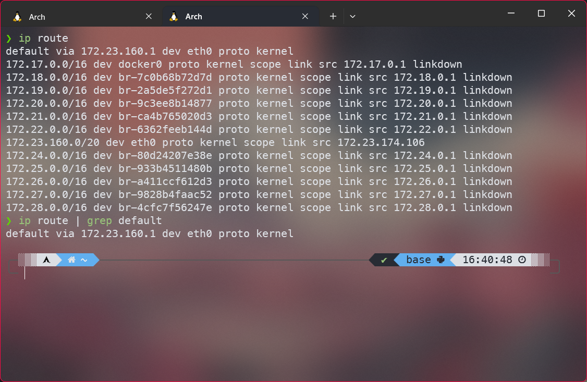
   Resultado:
   ```bash
   default via 172.23.160.1 dev eth0 proto kernel
   ```

2. **Verificación de Conectividad**
   ```bash
   ping 172.23.160.1
   ```
   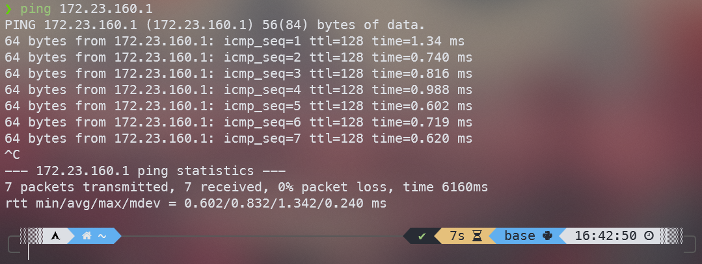

3. **Intento de Configuración QoS**
   
   Siguiendo los pasos del enunciado, intenté:

   **Paso 1.1 - Configurar clases de tráfico:**
   - URL: `https://172.23.160.1:443/restconf/config/ietf-qos`
   - Método: POST
   - Headers:
     ```
     Accept: application/yang-data+xml
     Content-Type: application/yang-data+xml
     ```
     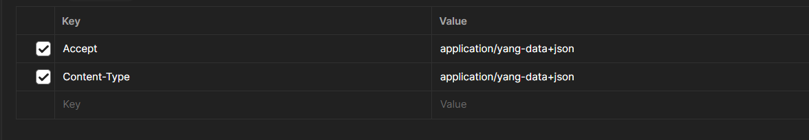
   - Body:
   ```xml
   <config xmlns="urn:ietf:params:xml:ns:yang:ietf-qos">
     <qos>
       <policy-map name="voice-priority">
         <class-map match="ip-dscp" match-value="af41">
           <priority>10</priority>
         </class-map>
         <class-map match="ip-dscp" match-value="default">
           <priority>5</priority>
         </class-map>
         <policy-statement name="voice-priority-statement">
           <output>
             <police rate="64 kbps" burst-size="128 bytes">
               <conform-to priority="10"/>
               <exceed non-conform-to priority="5"/>
             </police>
           </output>
         </policy-statement>
       </policy-map>
     </qos>
   </config>
   ```
   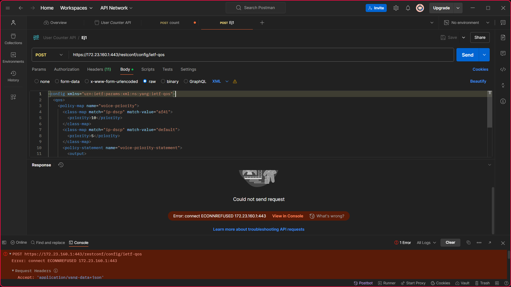

   **Paso 2.1 - Aplicar política a la interfaz:**
   - URL: `https://172.23.160.1:443/restconf/config/ietf-interfaces:interfaces/interface=GigabitEthernet1/10`
   - Método: POST
   - Headers: (mismos que el paso anterior)
   - Body:
   ```xml
   <config xmlns="urn:ietf:params:xml:ns:yang:ietf-interfaces">
     <interfaces>
       <interface name="GigabitEthernet1/10">
         <qos>
           <input>
             <policy-map name="voice-priority"/>
           </input>
         </qos>
       </interface>
     </interfaces>
   </config>
   ```
   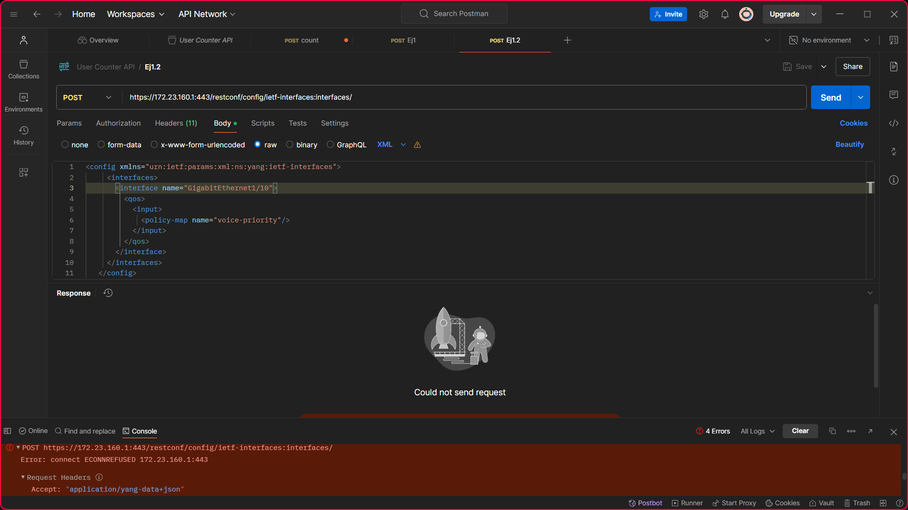

#### 1.2 Limitación Encontrada

Al intentar implementar la solución propuesta, se encontró que el router no responde a las solicitudes RESTCONF. Esto puede deberse a:

1. El módulo RESTCONF no está habilitado en el router
2. El módulo ietf-qos no está instalado
3. Problemas de conectividad o configuración SSL

#### 1.3 Verificación y Documentación

Para documentar el problema, intenté:

1. Verificar si RESTCONF está habilitado:
```bash
GET https://172.23.160.1:443/.well-known/host-meta
```
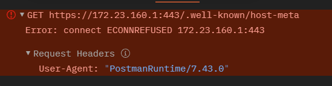

2. Verificar la configuración del router:
```bash
GET https://172.23.160.1:443/restconf/data/ietf-yang-library:modules-state
```
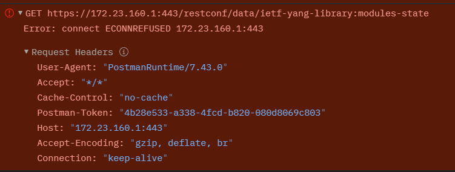

#### 1.4 Conclusiones

1. La implementación de QoS mediante RESTCONF requiere:
   - RESTCONF habilitado en el router
   - Módulo ietf-qos instalado
   - Configuración SSL correcta
   - Permisos adecuados

2. Para una implementación exitosa, sería necesario:
   - Verificar la versión de IOS-XE
   - Habilitar RESTCONF en el router
   - Instalar los módulos YANG necesarios
   - Configurar los certificados SSL apropiados

### Pregunta 2: Interacción Cliente/Servidor NETCONF

La interacción cliente/servidor NETCONF sigue una secuencia específica de eventos, donde los módulos YANG juegan un papel fundamental en la definición y validación de las operaciones. Estos son los pasos que se llevan a cabo:

1. **Inicialización del Servidor y Carga de Módulos YANG**:
   - Los módulos YANG se cargan y compilan en el servidor
   - Estos módulos definen la estructura de datos y operaciones permitidas
   - Se generan metadatos que incluyen:
     * Configuración del dispositivo
     * Estado de datos
     * Notificaciones disponibles
     * Operaciones permitidas
     * Configuración del sistema

2. **Preparación y Envío de Solicitud del Cliente**:
   - La aplicación cliente prepara una solicitud RPC (Remote Procedure Call)
   - La solicitud debe adherirse estrictamente al modelo de datos YANG
   - Se incluyen los parámetros necesarios según la operación
   - La solicitud se envía al servidor en formato XML o JSON

3. **Procesamiento en el Motor NETCONF/RESTCONF**:
   - El motor recibe la solicitud RPC
   - Utiliza los metadatos YANG para:
     * Validar la estructura de la solicitud
     * Verificar los permisos y restricciones
     * Comprobar la consistencia de los datos
   - Interactúa con la base de datos de configuración
   - Se comunica con los componentes del sistema según sea necesario

4. **Generación y Envío de Respuesta**:
   - El servidor construye una respuesta RPC-REPLY
   - La respuesta incluye:
     * Resultado de la operación
     * Datos solicitados (si aplica)
     * Mensajes de error (si ocurrieron)
   - La respuesta se formatea según el modelo YANG correspondiente
   - Se envía de vuelta al cliente en el mismo formato de la solicitud

Este proceso garantiza una interacción estandarizada y segura entre el cliente y el servidor, donde cada operación es validada contra los modelos YANG definidos, asegurando la integridad y consistencia de las configuraciones del dispositivo.

### Pregunta 3: Despliegue de Contenedores Docker 

#### 1. Preparación del Entorno en Arch WSL

Primero, me aseguro de tener Docker instalado en mi Arch WSL:

```bash
sudo pacman -S docker
sudo systemctl start docker
```

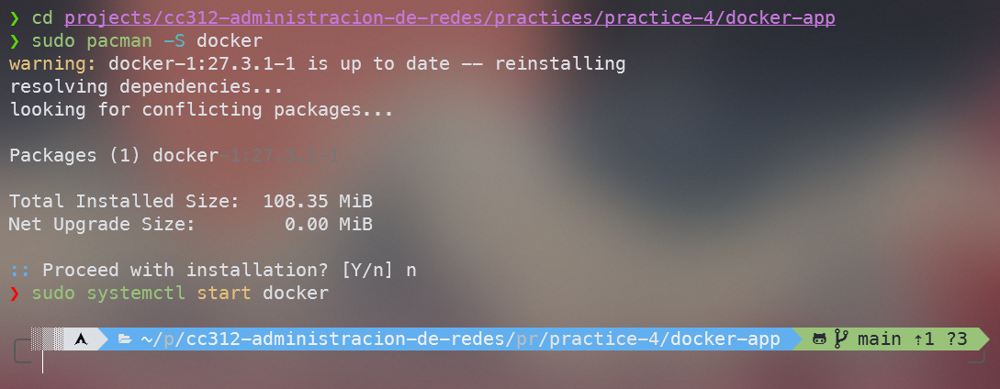


#### 2. Estructura del Proyecto

Creo la siguiente estructura de directorios dentro de mi carpeta de la pc4:

```
docker-app/
├── api1/
│   ├── Dockerfile
│   ├── requirements.txt
│   └── app.py
├── api2/
│   ├── Dockerfile
│   ├── requirements.txt
│   └── app.py
├── db/
│   └── init.sql
└── docker-compose.yml
```

#### 3. Implementación de los Servicios
Estaré usando FastAPI para las APIs.

##### API 1 (Inicio)

```python:docker-app/api1/app.py
from fastapi import FastAPI, HTTPException
from pydantic import BaseModel
import httpx

app = FastAPI()

class User(BaseModel):
    user: str

@app.post("/count")
async def count_user(user_data: User):
    async with httpx.AsyncClient() as client:
        try:
            response = await client.post(
                'http://api2:5001/register', 
                json={'user': user_data.user}
            )
            return response.json()
        except httpx.RequestError:
            raise HTTPException(status_code=500, detail="Error al comunicarse con API 2")

if __name__ == "__main__":
    import uvicorn
    uvicorn.run(app, host="0.0.0.0", port=5000)
```

```dockerfile:docker-app/api1/Dockerfile
FROM python:3.9-slim
WORKDIR /app
COPY requirements.txt .
RUN pip install -r requirements.txt
COPY . .
CMD ["uvicorn", "app:app", "--host", "0.0.0.0", "--port", "5000"]
```

```text:docker-app/api1/requirements.txt
fastapi
uvicorn
httpx
pydantic
```

##### API 2 (Registro)

```python:docker-app/api2/app.py
from fastapi import FastAPI, HTTPException
from pydantic import BaseModel
import asyncpg
from typing import Dict

app = FastAPI()

class User(BaseModel):
    user: str

async def get_db_pool():
    return await asyncpg.create_pool(
        host="db",
        database="userdb",
        user="postgres",
        password="postgres"
    )

@app.on_event("startup")
async def startup():
    app.state.pool = await get_db_pool()

@app.on_event("shutdown")
async def shutdown():
    await app.state.pool.close()

@app.post("/register")
async def register_user(user_data: User) -> Dict[str, int]:
    async with app.state.pool.acquire() as conn:
        # Inserto el usuario
        await conn.execute(
            "INSERT INTO users (username) VALUES ($1)", 
            user_data.user
        )
        # Cuento ocurrencias
        count = await conn.fetchval(
            "SELECT COUNT(*) FROM users WHERE username = $1", 
            user_data.user
        )
        return {"count": count}

if __name__ == "__main__":
    import uvicorn
    uvicorn.run(app, host="0.0.0.0", port=5001)
```

```dockerfile:docker-app/api2/Dockerfile
FROM python:3.9-slim
WORKDIR /app
RUN apt-get update && apt-get install -y curl
COPY requirements.txt .
RUN pip install -r requirements.txt
COPY . .
CMD ["uvicorn", "app:app", "--host", "0.0.0.0", "--port", "5001"]
```

```text:docker-app/api2/requirements.txt
fastapi
uvicorn
asyncpg
pydantic
```

##### Base de Datos

```sql:docker-app/db/init.sql
CREATE TABLE users (
    id SERIAL PRIMARY KEY,
    username VARCHAR(100) NOT NULL,
    created_at TIMESTAMP DEFAULT CURRENT_TIMESTAMP
);
```

##### Docker Compose

```yaml:docker-app/docker-compose.yml
version: '3.8'

services:
  api1:
    build: ./api1
    ports:
      - "5000:5000"
    depends_on:
      api2:
        condition: service_healthy

  api2:
    build: ./api2
    ports:
      - "5001:5001"
    depends_on:
      db:
        condition: service_healthy
    healthcheck:
      test: [ "CMD", "curl", "-f", "http://localhost:5001/docs" ]
      interval: 10s
      timeout: 5s
      retries: 5

  db:
    image: postgres:13
    environment:
      POSTGRES_DB: userdb
      POSTGRES_USER: postgres
      POSTGRES_PASSWORD: postgres
    volumes:
      - ./db/init.sql:/docker-entrypoint-initdb.d/init.sql
    ports:
      - "5432:5432"
    healthcheck:
      test: [ "CMD-SHELL", "pg_isready -U postgres" ]
      interval: 5s
      timeout: 5s
      retries: 5
```

#### 4. Despliegue

Para desplegar los servicios, ejecuto:

```bash
cd docker-app
docker compose up --build
```

Los servicios se iniciarán en el siguiente orden:
1. La base de datos se inicia y espera hasta estar lista para aceptar conexiones
2. API2 se inicia una vez que la base de datos está saludable
3. API1 se inicia después de que API2 esté funcionando correctamente

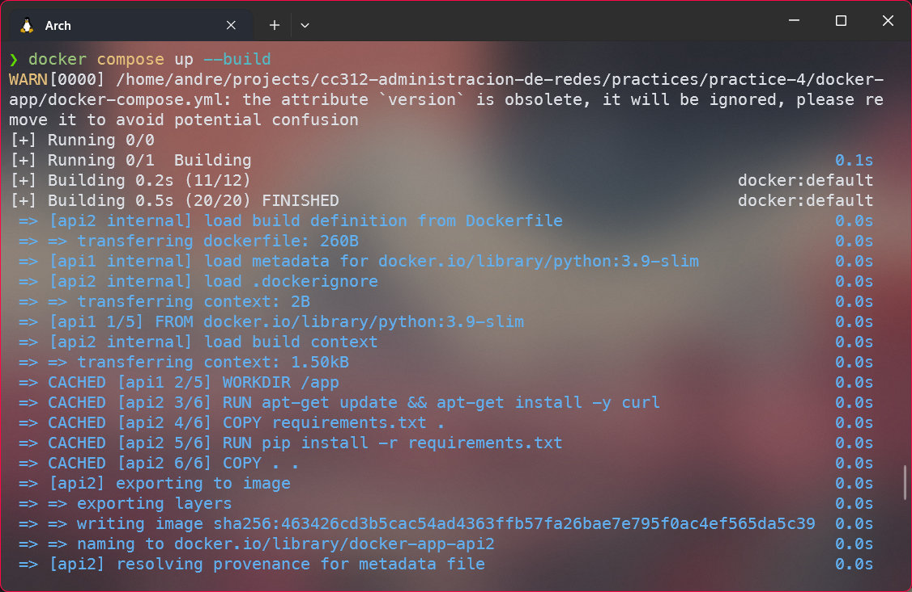

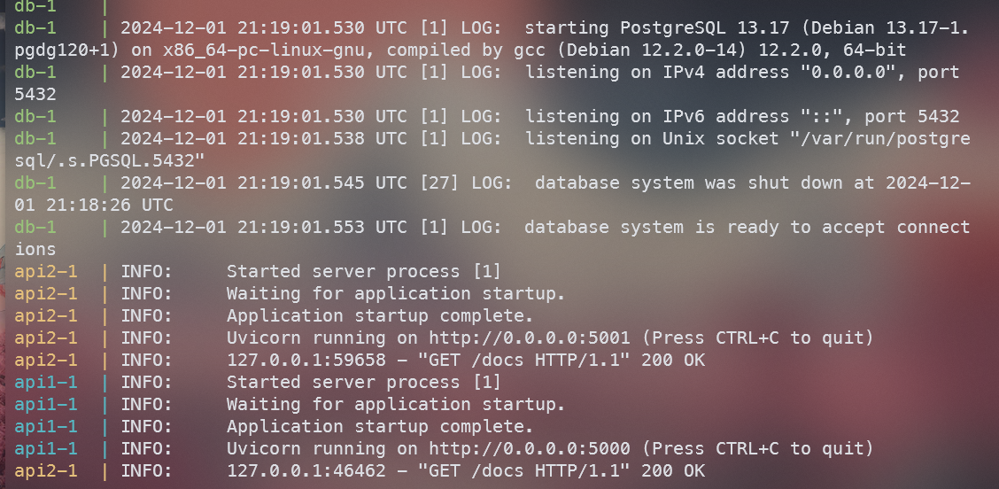


#### 5. Pruebas
Para probar el sistema, voy a usar Postman:
1. Abro Postman y creo una nueva colección llamada "User Counter API"
2. Dentro de la colección, creo una nueva solicitud POST
3. Configuro la URL: `http://localhost:5000/count`
4. En la pestaña "Headers", agrego:
   - Key: `Content-Type`
   - Value: `application/json`
   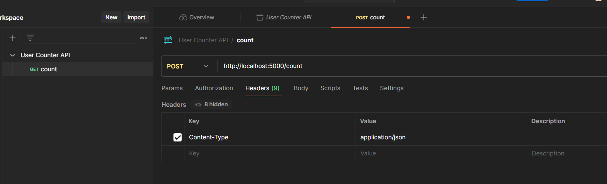
5. En la pestaña "Body":
   - Selecciono "raw"
   - Selecciono tipo "JSON"
   - Ingreso el siguiente JSON para cada prueba:
```json
{
    "user": "Carlos"
}
```

Realizar múltiples solicitudes cambiando el valor de "user" para probar el contador:
- Primera solicitud con `"user": "Carlos"`
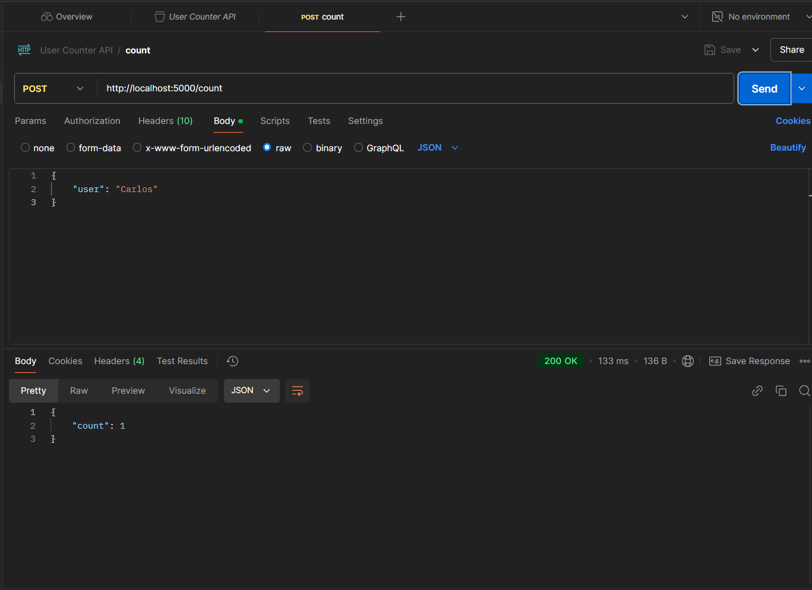
- Segunda solicitud con `"user": "Carlos"`
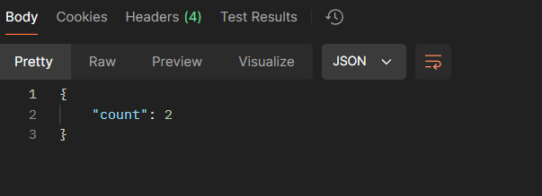
Ahora muestra count: 2
- Nueva solicitud con `"user": "Cesar"`
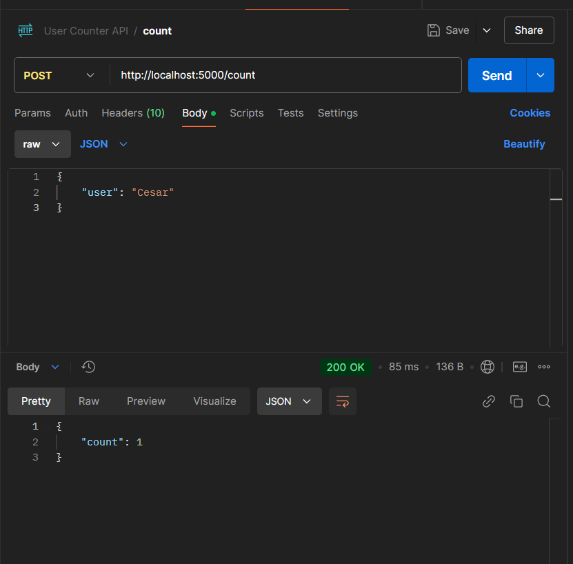
Muestra count: 1

También puedo acceder a la documentación automática de la API en:
- API 1: http://localhost:5000/docs
- API 2: http://localhost:5001/docs

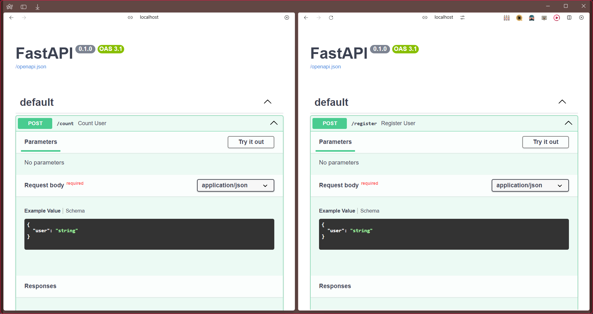

Este sistema implementa una arquitectura de microservicios donde:
- API 1 actúa como punto de entrada y se comunica con API 2
- API 2 maneja la lógica de negocio y la interacción con la base de datos
- La base de datos PostgreSQL almacena y cuenta los registros de usuarios

La comunicación entre servicios se realiza a través de HTTP, y los contenedores están conectados mediante la red de Docker Compose.
