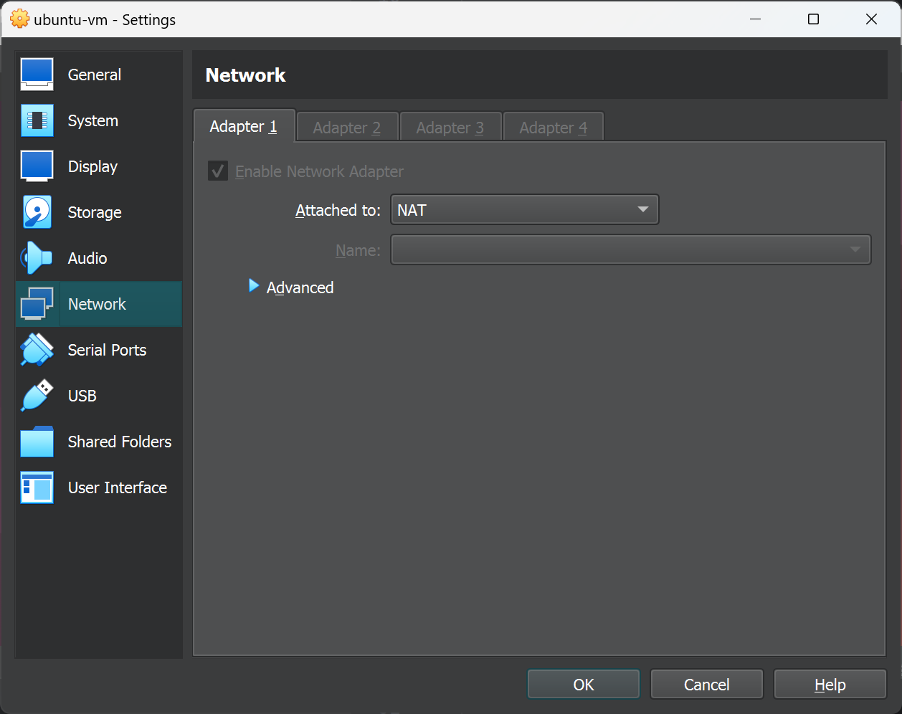

# Laboratorio I

## Proceso de instalación

## Proceso de configuración del VM
En este caso se usa el iso de Ubuntu

## Dentro de la VM
Empieza el proceso de instalación

Utilicé el layout en inglés internacional con dead keys por mi teclado (soporta caracteres especiales)

Se instalaron drivers propietarios porque tengo una tarjeta de video NVIDIA

Esperamos a la instalación...

Listo! Ahora reiniciamos la maquina virtual

Trabajo concluído! 

### Configuración adicional de la máquina virtual

La red estaba por defecto en NAT así que lo dejé así.

Se activó el compartimiento bidireccional de portapapeles.

Por la resolución de mi pantalla original tuve que incrementar el tamaño de la pantalla de la VM.

## Instalación de programas
1. Pycharm Professional Edition

2. JupyterLab Desktop

También se descargó vía terminal con el comando.deb el navegador Vivaldi

